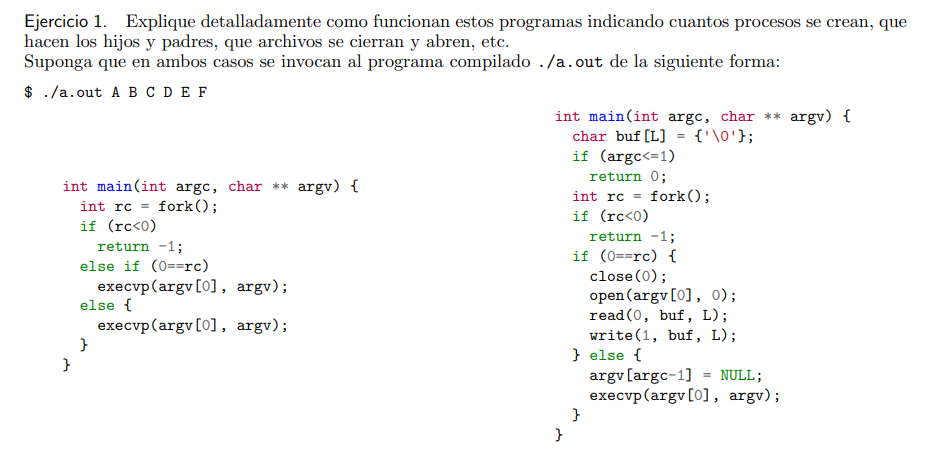
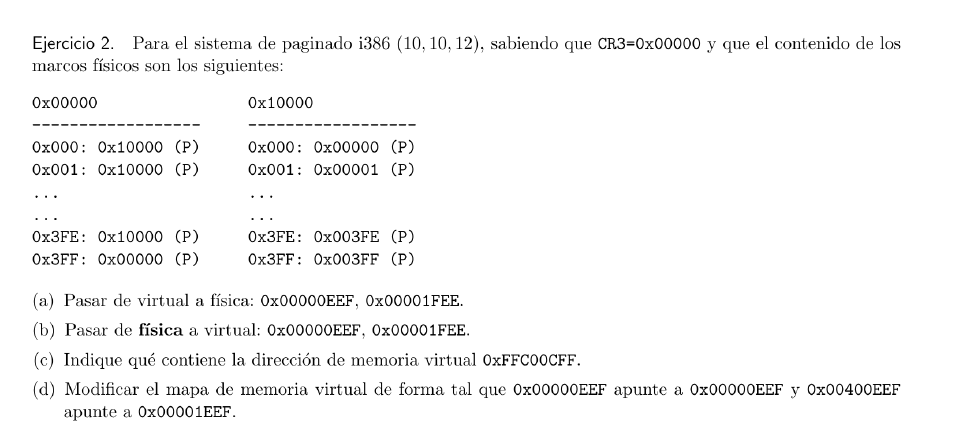
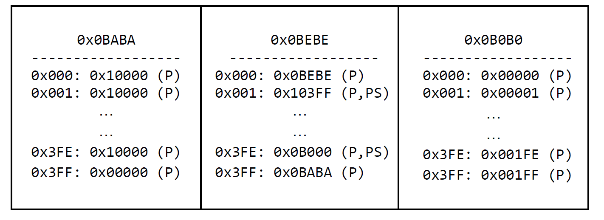
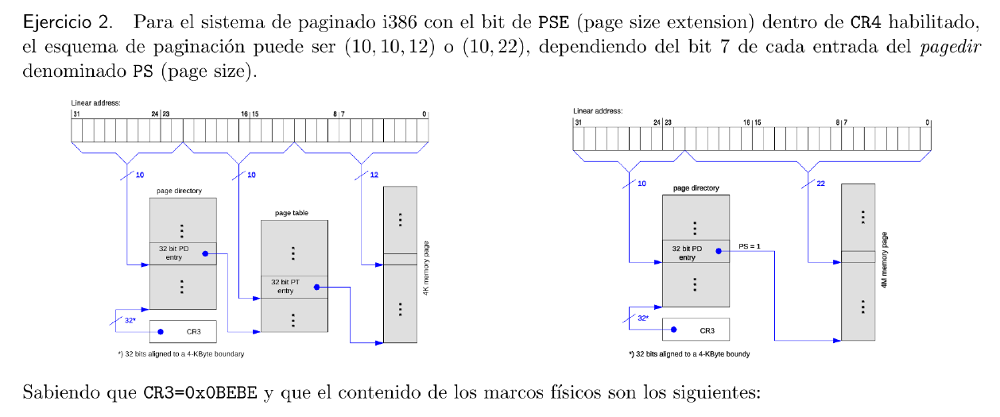
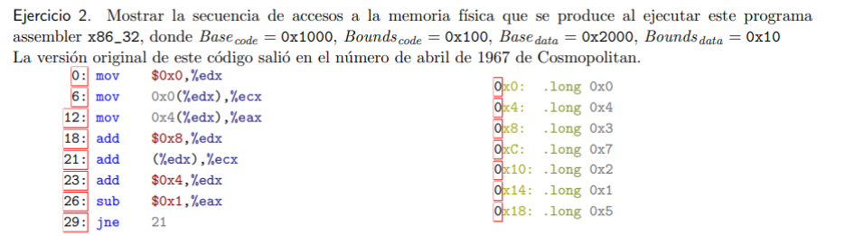
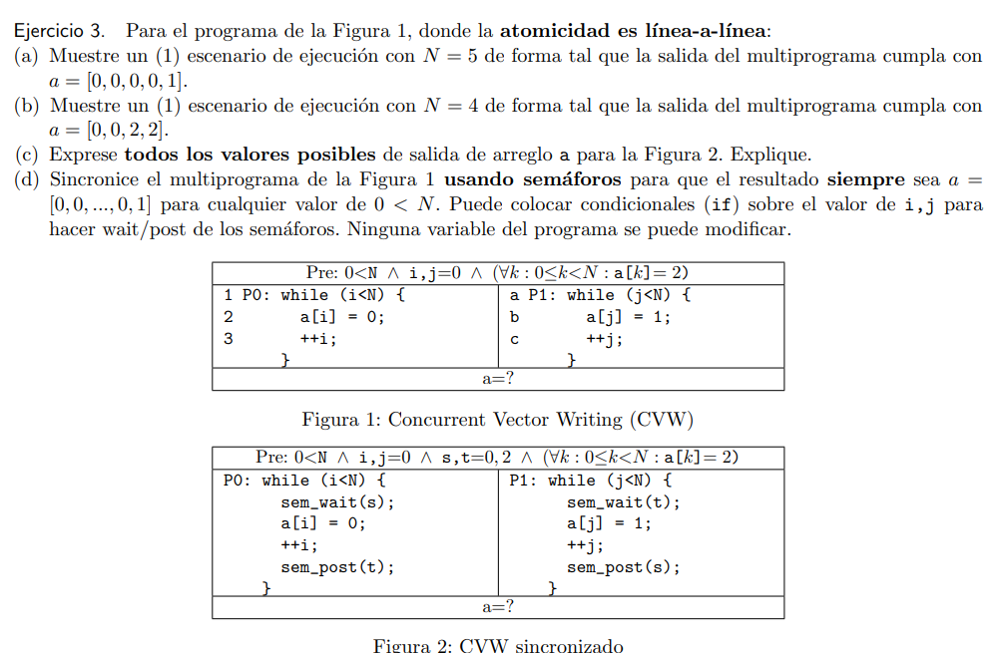
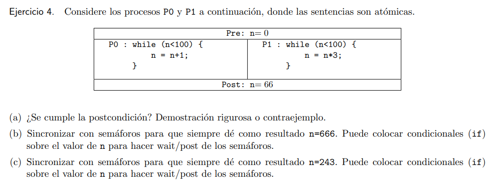
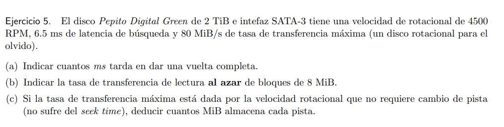
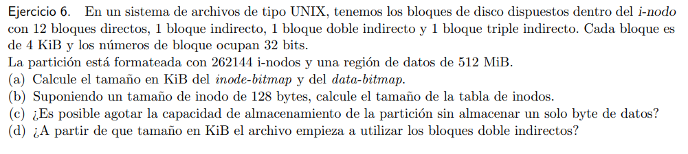
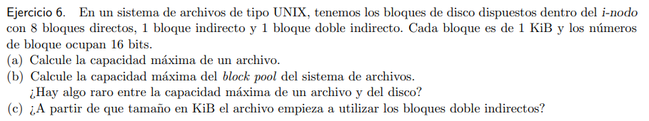

# VIRTUALIZACIÓN

## Primer tipo de ejercicio:

### Cosas a tener en cuenta.

- fork(); Crea un proceso. Devuelve 0 en caso hijo, \>0 en caso padre.
El if es para indicar que hace el padre y el hijo en base al return
- execvp(); Esta funcion recibe como argumento un programa y un array,
el array contiene el programa y argumentos.
    - **IMPORTANTE**: NO CREA UN NUEVO PROCESO, SI NO QUE REEMPLAZA AL QUE SE
ESTABA EJECUTANDO
- FD: Un file descriptor es un int que sirve para identificar archivos
abiertos. 0 STDIN (input) 1 STDOUT (output) 2 STDERR( error)
- close(FD); Cierra el archivo y FD que le pasamos, sin mas.
- open(archivo, flag); Abre en el FD mas chico (numero) el archivo que
le pasamos con la flag que le pasemos xdd. si la flag es 0, entonces
solo tiene permiso de lectura. IMPORTANTE
- read(FD, buffer, cantBytes); Lee el FD y lo mete en el buffer. La
cantBytes vendria a ser el tamaño
- write(FD, buffer, CantBytes); Escribe en el FD lo que haya en buffer,
la cantBytes seria el tam del buffer

# Paginacion

## Primero que hay que hacer
identificar es el sistema de paginado con el que vamos a trabajar.

## caso del ejemplo 1
el sistema es i386 (10,10,12) esto quiere
decir que en este esquema
Los primeros 10 bits son para indexar el page directory, luego,
tenemos 10 bits para indexar la page table y por último los 12 bits
son el offset dentro de una page.

Sin embargo, en el ejemplo 2, como lo indica el enunciado, el esquema
de paginacion va a depender del bit **PS** de cada entrada del
**pagedir**.

El esquema en tanto puede ser (10,10,12) o en su defecto (10, 22).

## Pasaje de direcciones
Es posible que se nos pida pasar direcciones virtuales a física
o viceversa. También se nos puede pedir que pasemos direcciones
físicas a TODAS las virtuales.

### pasar direcciones virtuales a físicas
tenemos que pasar la
dirección que se nos provee en hexa a binario y separar los bits según
el esquema de paginación que tengamos, luego de eso, tenemos que
seguir el "camino" correspondiente hasta llegar a la dirección
deseada.

#### ejemplo 1)
se nos pide pasar la dirección
virtual 0x00000EEF a física.

0x00000EEF = 0x00000EEF= 0000 0000 0000 0000 0000 1110 1110 1111

PD PT OFFSET

Como CR3 = 0x00000

Luego, la dirección física es 0x00000EEF

### Pasar de física a virtual
el tip está en deducir "todos los
caminos que me lleven a esa direccion fisica".

A modo de ejemplo tenemos la direccion fisica 0x00000EEF

# POSIBLE EJERCICIO DE ASSEMBLER EXTRA

## Ejercicio

## Cosas a tener en cuenta
- Aca nos dice que nuestro codigo arranca en 0x1000 y tiene un limite de
0x100.
- Osea que si en codigo te vas de 0x1100 da SF (Segmentation
Fault).

Despues tenemos que tener en cuenta que la data arranca en
0x2000 y tiene un limite de 0x10. Osea que si nos pasamos para 0x2010
da SF de nuevo. **Observemos tambien que como tenemos una direccion a
la izquierda, la asignacion es de derecha a izquierda.**

**Bien, cada vez que accedamos a una linea, se hace el calculo:**

**Base**~**code**~** + linea.**

Ejemplo, supongamos que ejecutamos la linea 18:

0x1000 + 0x18 = 0x1018.

Luego, en tema Base~data~ hay que revisar que tenemos algo a la
izquierda en la linea que puede sumar.

Por ejemplo, en la linea 12 0x4(%edx),%eax, si bien %edx = 0x0, como
tiene esa cosa a la izquierda se convierte en 0x0 + 0x4.

Bien, luego fijemonos que no pasa nada si queremos acceder a %edx que
seria %0x0. Puesto que nuestra base data se la banca. Pero fijemonos
que en la linea 29 va a loopear de nuevo. Cuando nuestro programa
quiera acceder a 0x10 o mas, va a dar SF.

Bien, en este tipo de ejercicios no hay mucha complicacion. En el a y
b deberiamos de intentar lograr que se llegue a ese escenario usando
los programas enteros o por lineas. En general son faciles. **Puede
ser que no exista caso de
ejecucion**

c)En este caso prestarle atencion a el valor del semaforo, si es 1,
entonces seria todo \[0,0,0,0,..,0\]. En este caso tenemos 2, por lo
que hay que ver los casos donde gane el de la derecha o el de la
izquierda, pero siempre arrancaria por 0.

d\) En este tipo de ejercicio tenes que rebuscartela un poco, podes
usar un if para postear despues de cierto I o J ponele.

En este ejercicio es facil, fijate en a) que la mayoria de veces no se
cumple, digamos en cualquier ejercicio porque hay muchas formas de
salir del bucle. y en el b y c deberias ver si podes llegar
dividiendolos por alguno que multiplique
ponele.

a)  Este ejercicio es igualisimo al practico. 1/CantRPM, y vas pasandolo
    primero a segundos (\*60) y despues a Ms
    (\*1000)

b)  En este ejercicio hay 3 cosas a calcular, primero la transferencia.

Transferencia = TamBloque/TransfMaxima

TiempoIO = Latencia + (VueltaCompletaMs/2) + Transferencia

LecturaIO = TamBloque/TiempoIO

a)  En este ejercicio lo que calculamos es LectCabezal
    =TransfMaxima/Cabezales. Luego LectCabezal/RPS donde RPS = RPM \*
    60.

a)  para el inode-bitmap debemos pasar los inodos a bits y pasarlo a
    KiB. Notar que como estan en bits primero habria que dividir por 8
    para obtenerlos en Bytes. Y para el data-bitmap, sabemos que cada
    bloque ocupa un bit en el data-bitmap, y que tenemos 512MiB
    repartidos en 4KiB. Por lo que si los dividimos obtendremos el
    tamaño. (Capaz conviene tenerlos en bytes o no se, cosa suya
    ea).

b)  size tabla de i-nodes = cantidad de i-nodes \* size de struct inode

c)  Es posible, si usamos todos los inodes disponibles con archivos
    vacios

d)  Para este tipo de pregunta, calculamos (bloques directos +
    indireccion^1^+\...+indireccion^n^)\*TamBloqueKiB

Este es el otro tipo de ejercicio que te podes topar.

a)  Para esto tenes que calcular

CantidadPunteros = TamBloque / numerosDBloque (Esto siempre son los
bits que te indican)

Luego, tenemos que realizar el calculo (Bloques directos +
cantblockInd(CantPunteros)^1^ + ... +
cantBlockInd(cantPunteros)^n^)\*tambloc

a)  Aca te lo pueden decir como data region o como block Pool. La
    formula es 2^BitsNumBloque^ \* TamBloque

Lo que puede pasar de raro es que el archivo sea mas grande que la
data region

a)  Este lo explique antes, es hacer el calculo del a) pero hasta la
    indireccion anterior a la que te piden

