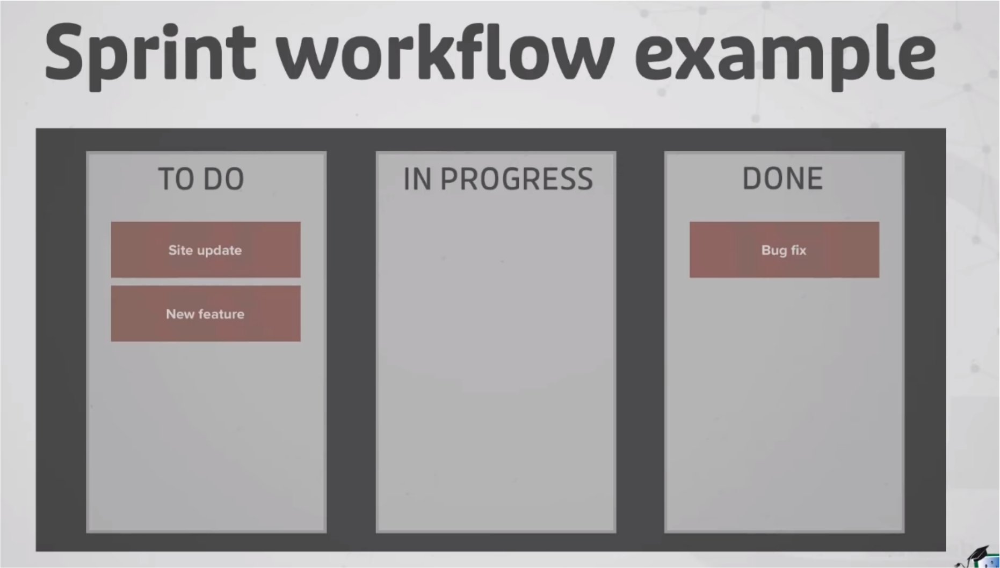
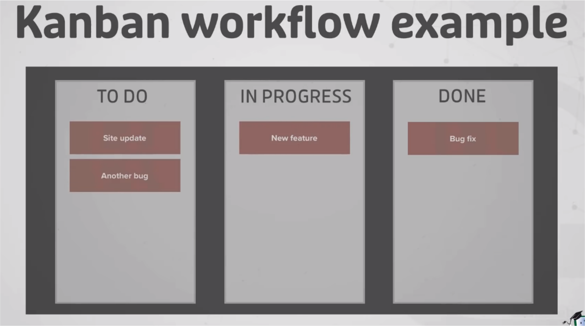
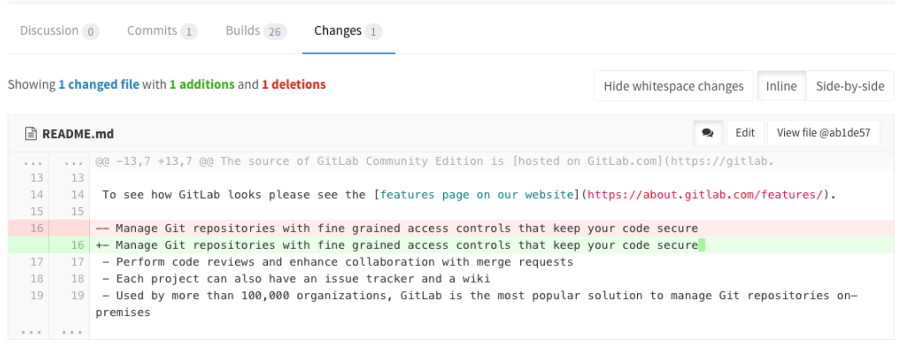

\tableofcontents

# Conceptos de metodologias agiles
## Sprints
### Definicion
Un sprint es una cantidad pre-determinada de tiempo en donde los equipos deciden que tareas se deben completar

Al final de cada sprint se realiza un **sprint meeting**

### Sprint meeetings
- Discutir el ultimo sprint
- Que salio bien?
- Que salio mal?
- Que podemos mejorar en el siguiente sprint?
- Discutir y acordar las tareas que se van a realizar el proximo sprint

## User Stories
### Formato general
Como un **[tipo de usuario]**, quiero poder **[realizar una accion]** para conseguir **[un valor/beneficio]**

### Ejemplo
- Como un **usuario de mybash**, quiero poder **escribir un comando con varios argumentos** para conseguir **que el programa se ejecute de la manera que quiero**

## Puntos extra
- Podemos hacer que sea un proceso iterativo y ver que cosas funcionan para el equipo y que cosas no
- Usar metodologias agiles es algo que valoran los profes
- Podemos enfocarnos en evitar la burocracia inutil

# Frameworks agiles
## Scrum
Tiene sprints y se intenta no arrancar nuevas tareas antes de terminar las tareas que ya fueron comenzadas


## Kanban
No tiene sprints y se van agregando tareas a medida que es necesario


# Como se organizan las empresas
## Organizacion general de una empresa que usa SCRUM
Un proyecto de software suele tener los siguientes pasos:

- Se crean los requerimientos
  - Por lo general se expresan mediante User Stories\

- Las tareas a realizar para cumplir con las User Stories van a un backlog
- Se coordina con el equipo que tareas se pueden completar en el proximo sprint y el equipo se compromete a realizarlas

## Consideraciones
- Para que los miembros del equipo eviten "pisarse" entre si es importante que las historias de usuario no se pisen
- Si aun así hay problemas, Git ofrece herramientas que permiten solucionar este tipo de conflictos

# Convenciones en un proyecto
## Para que sirven?
Es util que en un equipo de software se acuerden las practicas que se quieran llegar a cabo en el desarrollo de un proyecto, ya que se obtiene una mayor consistencia y calidad en el codigo generado.

## Ejemplo Rapido
Un equipo de software puede decidir seguir el consejo del libro *Clean Code de Robert C. Martin* y optar por programar funciones o procedimientos que:

- Sean lo mas pequeños posibles, 
- tengan un nombre que incluya un verbo 
- Tengan argumentos con nombres descriptivos

### Ejemplo parcial en C
::: columns

:::: column

```C
  void roberto(a)
{
  printf("%d\n", a);
}

```

::::

:::: column


```C
void imprimir_entero(entero)
{
  printf("%d\n", entero);
}
```

::::

:::

## Herramientas utiles
Se puede usar un formateador automatico de codigo para que el codigo a lo largo del proyecto tenga un estilo consistente.

Esto tambien evita que se agreguen cambios poco relevantes en el whitespace cuando se hace un commit

## Ejemplo

