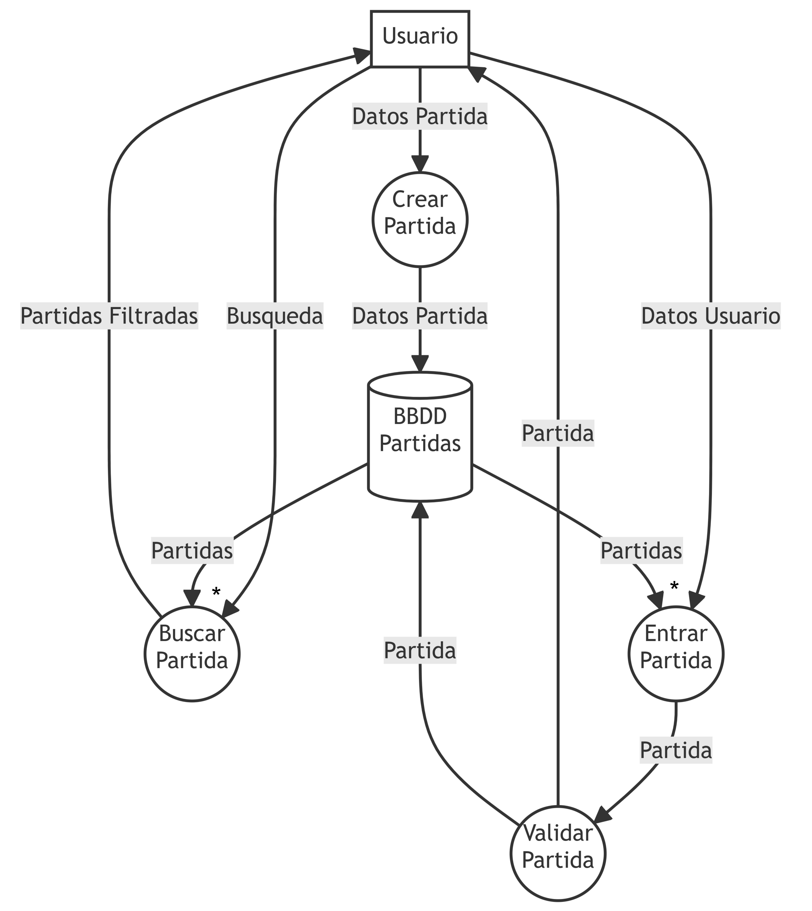

# DFD
## Crear partida
{ width=500 }

### Diccionario de Datos
```
Datos Partida = Nombre + MaxJugadores + Contraseña + Region
Busqueda = Nombre + Region
Datos Usuario = Nombre + Region
```

## Turno completo
{ width=500 }

### Diccionario de Datos
```
Datos Intercambio = Jugador Objetivo + Carta Intercambio
Datos Descarte = Mano + Carta a Descartar
```
