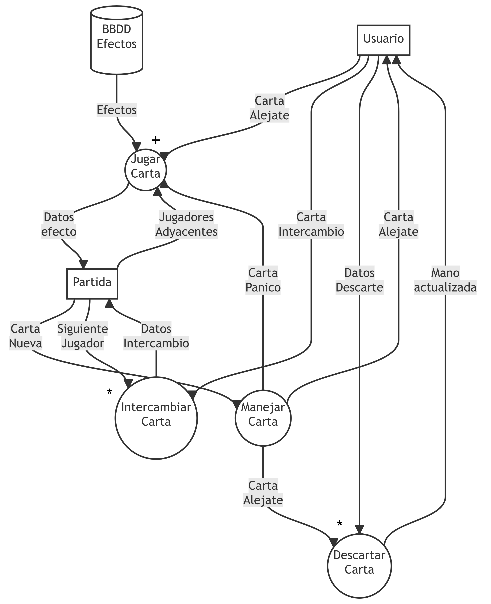
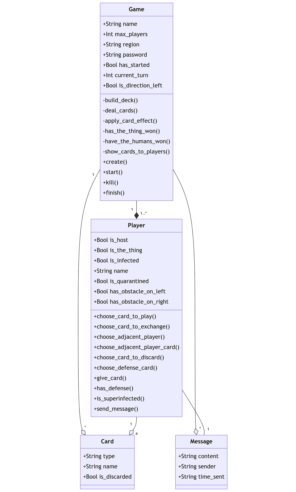

# Alcance del proyecto

## Objetivos
El objetivo del proyecto consiste en implementar un sistema de software que permita a varios jugadores jugar al juego de cartas "La Cosa".

## Facultades del usuario
El usuario podrá:

- Elegir un nombre de usuario.
- Crear una sala:
    - Con o sin contraseña.
    - Con un número específico de jugadores mínimos y máximos.
    - Con un nombre único determinado por el usuario.
- Enviar mensajes a los demás jugadores presentes en una misma partida.
- Ver una lista de partidas disponibles.
- Buscar una partida con un nombre específico.

El usuario no podrá:

- Abandonar una partida.

## Facultades del anfitrión de una partida
El anfitrión es aquel jugador que haya creado la sala.

El anfitrión podrá:

- Decidir cuándo comenzar la partida.

El anfitrión no podrá:

- Expulsar a jugadores de una partida.

## Requerimientos no funcionales

#### Usabilidad
\

- **Interfaz Intuitiva:** La interfaz de usuario debe ser fácil de usar y comprensible para los jugadores.
- **Instrucciones de juego:** Deben proporcionarse instrucciones claras para que los usuarios comprendan cómo utilizar el sistema.

#### Escalabilidad
\

- **Escalabilidad Horizontal:** El sistema debe ser capaz de escalar horizontalmente para admitir un mayor número de usuarios y partidas concurrentes.
- **Rendimiento:** El sistema debe mantener un rendimiento óptimo incluso cuando haya un gran número de usuarios en línea.

# DFD
## Crear partida
{ width=500 }

### Diccionario de Datos
```
Datos Partida = Nombre + MaxJugadores + Contraseña + Region
Busqueda = Nombre + Region
Datos Usuario = Nombre + Region
```

## Turno completo
{ width=500 }

### Diccionario de Datos
```
Datos Intercambio = Jugador Objetivo + Carta Intercambio
Datos Descarte = Mano + Carta a Descartar
```

# Diagrama de clases del proyecto
{ width=3500 }

\newpage
# Casos de uso
## Crear partida
Actor primario: Usuario

Precondicion: el usuario ha ingresado su nombre de usuario y se encuentra viendo la lista de partidas

### Escenario principal
1. El usuario accede a la opcion de crear nueva partida
2. El sistema le pide al usuario que ingrese los siguientes datos para poder inciar la partida:
    - Nombre de partida
    - Cantidad máxima de jugadores
    - Region de la partida.

3. El usuario ingresa los datos necesarios para crear una partida
4.
    a) El usuario ingresa una contraseña, eligiendo así que su partida sea privada.
    b) El usuario deja el campo de contraseña vacio, eligiendo así que su partida sea pública.
5. El usuario accede a la opcion de crear partida.
6. El sistema confirma que la partida se ha creado correctamente y se muestra
la interfaz principal del juego

### Caso excepcionales
#### El usuario no ingresa un dato requerido
6. Se notifica al usuario que hay datos faltantes que son necesarios para crear la partida
y se indica cuales son.

#### El nombre de la partida ya existe
6. Se notifica al usuario que debe cambiar el nombre de la partida, ya que existe una partida
con el nombre elegido.


\newpage
## Turno completo
Actor primario: Usuario

Precondicion: El usuario se encuentra en una partida en marcha

### Escenario principal
1. El sistema le da una carta del mazo al usuario
2. El usuario accede a la opcion de jugar carta
3. El usuario selecciona una carta "Alejate" de su mano.
4. El sistema ejecuta los efectos de la carta.
5. El usuario elige una carta Alejate de su mano y se la intercambia por otra carta
al jugador siguiente segun el orden del juego.
6. El turno del usuario termina y comienza el turno del siguiente jugador

### Casos excepcionales
#### Carta alejate afecta a otros jugadores
4. El sistema muestra al usuario los jugadores disponibles sobre quienes pueda jugar la carta.
    Es decir, todos aquellos jugadores adyacentes al usuario que no esten detras de un obstaculo.
5. El usuario selecciona a un jugador adyacente.
6. El sistema muestra a los jugadores la carta jugada.
7. Se le da la opcion al jugador afectado de jugar una carta de Defensa como respuesta.
8.
    a) Si el jugador afectado no tiene o no elige alguna carta de defensa
    el sistema ejecuta el efecto de la carta.
    b) La carta de Defensa del jugador afectado bloquea el efecto de la carta del usuario.
9. El usuario elige una carta Alejate de su mano y se la intercambia por otra carta
al jugador siguiente segun el orden del juego.
10. El turno del usuario termina y comienza el turno del siguiente jugador

#### Descarte
2. El usuario accede a la opcion de descartar una carta de su mano
3. El usuario selecciona una carta "Alejate" de su mano.
4. El usuario elige una carta Alejate de su mano y se la intercambia por otra carta
al jugador siguiente segun el orden del juego.
5. El turno del usuario termina y comienza el turno del siguiente jugador

#### El acceso al jugador siguiente al usuario está bloqueado
5. No se realiza el intercambio
6. El turno del usuario termina y comienza el turno del siguiente jugador

#### Superinfeccion\
**Descripcion:** El usuario solo posee cartas "Infectado" en su mano y no está infectado.

5. No se realiza ningun intercambio
6. El sistema revela la mano del usuario.
7. El sistema hace que el usuario sea eliminado de la partida.
8. Comienza el turno del siguiente jugador


\newpage

## Jugar una carta de sospecha
Actor primario: Usuario

Precondicion: El usuario se encuentra en una partida en marcha y posee una carta
de sospecha en su mano

### Escenario principal
1. El usuario juega la carta de sospecha
2. El sistema presenta al usuario la opcion de escoger un jugador adyacente
que no esté bloqueado por un obstaculo.
3. El sistema presenta al usuario la opcion de escoger una de las cartas de
    la mano del jugador elegido.
4. El sistema muestra al usuario la carta elegida.

