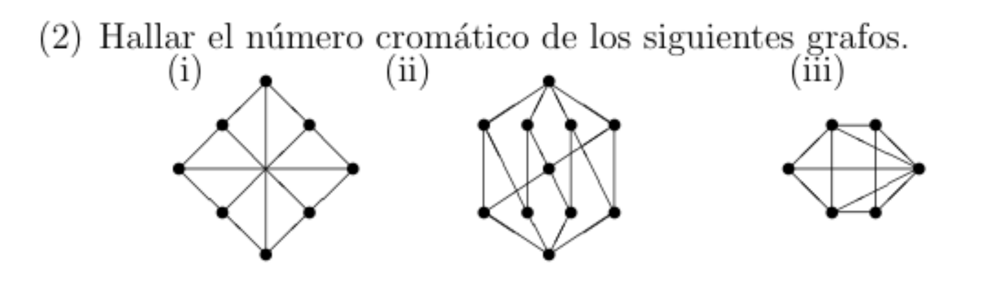

# Practico 1
## 2)


#. Encontrar algun subgrafo para el cual se sepa su número cromatico
#. Plantear $\chi(H) \le \chi(G)$ #. Dar un coloreo para el grafo que usa C colores, buscando que $C = \chi(H)$
#. Plantear $\chi(G) \le C$
#. Pleantear que como $\chi(H) = C \Rightarrow \chi(G) = C$

## 3)
Para cada caso (r impar, $r=2$ y $r>2$ y r par $>2$))

#. Visualizar como se veria el grafo
#. Encontrar algun subgrafo para el cual se sepa su número cromatico
#. Plantear $\chi(H) \le \chi(G)$
#. Dar un coloreo para el grafo que usa C colores, buscando que $C = \chi(H)$
Este coloreo puede ser definido como una funcion definida por casos que toma argumento un $i$ que es el i-esimo vertice
Ver los casos para los cuales la funcion C no puede ser igual.
Por ejemplo:  $C(i) \neq C(i+1)$
#. Plantear $\chi(G) \le C$
#. Pleantear que como $\chi(H) = C \Rightarrow \chi(G) = C$

## 6)
- Con los ciclos se puede decir que son simetricos por rotacion

#. Visualizar grafo
#. Demostrar que no existe un coloreo propio con 3 colores
    - Tomar un subgrafo y plantear un lema en base a el
    - Demostrar lema
    - Buscar llegar a un absurdo al aplicar el lema en el grafo entero
#. Dar un coloreo propio con 4 colores
    - Ver casos segun cada tipo de vertice
#. Plantear $4 \le \chi(G) \le 4 \Rightarrow \chi(G) = 4$

## 7)

#. Visualizar grafo con un ejemplo mas chico de $G_n$
    - Pensar en que significa que $mcd(i,j) = 1$
#. Encontrar algun subgrafo para el cual se sepa su número cromatico
#. Plantear $\chi(H) \le \chi(G)$
#. Dar un coloreo para el grafo que usa C colores, buscando que $C = \chi(H)$
    - Este coloreo puede ser definido como una funcion definida por casos que toma argumento un $i$ que es el i-esimo vertice
    - Ver los casos para los cuales la funcion C no puede ser igual.
    - Por ejemplo:  $C(i) \neq C(i+1)$
#. Demostrar que el coloreo es propio viendo los distintos casos
#. Plantear $\chi(G) \le C$
#. Pleantear que como $\chi(H) = C \Rightarrow \chi(G) = C$

## 8)

#. Visualizar grafo con n chicos
    - Ver cuales son los coprimos de 6
    - Usar coordenadas para definir los vertices
#. Encontrar algun subgrafo H para el cual se sepa su número cromatico
#. Plantear $\chi(H) \le \chi(G)$
#. Dar un coloreo para el grafo que usa C colores, buscando que $C = \chi(H)$
    - Ver casos en los que dos vertices estan conectados, usando dos vertices (a,b) y (c,d)
#. Demostrar que el coloreo es propio viendo los distintos casos
    - Evaluar C(i,j) en cada caso y probar que $C(a,b) \neq C(c,d)$ para demostrar que se cumple
#. Plantear $\chi(G) \le C$
#. Pleantear que como $\chi(H) = C \Rightarrow \chi(G) = C$

## 10)
#. Dar un coloreo propio con 4 colores
#. Demostrar que no existe un coloreo propio con 3 colores
    - Dar un coloreo general para algun subgrafo
    - Deducir un coloreo general para el resto de vertices
    - Ver si se llega a un absurdo
#. Plantear $4 \le \chi(G) \le 4 \Rightarrow \chi(G) = 4$

## 12)
### Clase
Tomar subgrafo con todos los vertices menos el vertice cuyo lado es delta
Como por propiedad p < k, al agregar x se aumenta el NC, los vecinos de x deben tener todos los colores
por lo cual: delta >= p
como el maximo de aumento del NC es 1: p+1 = k
Y hay que llegar a que delta+1 >= k

Ideas:
1) Tomar x con grado delta
2) Para que x use nuevo color los vecinos de x tienen que incluir todos los colores
3) k = p+1

# Practico 2
## 1)
- Pensar en algun flujo donde las capacidades no tengan interseccion

## 2)
### Notas
Un flujo maximal es cuando se esta mandando todo lo que se puede y ser recibe todo lo que se puede

### Howto
#. Partir de un network super basico
#. Ver si sirve de contraejemplo para alguna de las preguntas.
#. Añadir mas cosas al network y volver al paso anterior

## 3)
- Prestar mucha atencion a los dominios de las "funciones"

#. Graficar todas las transformaciones que hay que hacer para usar la caja negra
    - P1 -T1-> P2 -> CN -> S2 -T2> S1  

#. Ver como adaptar el problema a la caja negra
    - Hacer un ejemplo de un network con un loop y ver de que manera transformarlo para que no afecte.
    - Hacer un ejemplo de un network con un lado paralelo y ver de que manera transformarlo para que no afecte
#. Ver como adaptar la solucion de la caja negrea a la solucion que buscamos
#. Demostrar que el flujo obtenido es flujo del problema original

## 7)
- Tener en cuenta teorema de la integralidad
- Es posible aplicar FF para demostrar

#. Hacer un ejemplo sencillo. Arrancar con al menos 4 vertices
#. Ver si se llega a alguna conclusion.
#. Complicar el ejemplo y repetir el paso anterior

- Para llegar a un flujo maximal impar en un flujo par no hay que usar todas las capacidades.
    - Y similar para el caso par -> impar

## 8)
- Pensar en que la **capacidad** por vuelo es de 1 agente
    - Por ende, no podemos mandar medio agente
    - Esto que caracteristica le da al flujo?
- Que algoritmo va muy bien para flujos maximales enteros?

# FF
- Armar network residual con los flujos que se pueden deshacer y los flujos que aun se pueden tomar

# Practico 3
## EK
### Idea
EK puede ser pensado como un algoritmo para encontrar el menor camino aumentante de s hasta t

### Notacion
Para resolver EK usamos la siguiente notacion:

```
sB C A  D t
 s B C- A D
 9 9 7  5 5
```
1) La primer columna son los vertices que vamos agregando
2) La segunda columna es quien los agrego, si es un lado backward lleva exponente "-"
3) La tercer columna es el flujo que puede ser mandado

o mas explicito:

### Pasos
1) Armar primer camino aumentante (BFS) con notacion adecuada 
2) Reconstruir camino empezando desde t (leyendo segunda fila)
3) Hacer una tabla con las capacidades sobrantes 
    - Solo cambia si pertenece al camino aumentante formado
4) Armar siguiente camino aumentante
    - Si un flujo esta saturado, devolver flujo por donde vino

## 2)

- Tener en cuenta el orden en el que se agregan los vertices y en el que se exploran
- Hay que buscar armar un network con la forma de una S que tiene un agujero en el medio

#. Partir de un network super basico
#. Ver si sirve
#. Añadir mas cosas al network y volver al paso anterior

# Algoritmos
## Dinic
#. Armar network auxiliar por niveles (BFS)
  - A partir de las segunda iteracion se toman solo los que tienen capacidad mayor a 0
#. Hacer DFS desde s hasta t hasta que se llegue a un flujo bloqueante
  - Si se llega a un camino sin salida hacer backtrack y seguir hasta llegar a t
#. Sumar los cuellos de botella de todos los caminos aumentantes encontrados para encontrar el max flow
#. Repetir pasos anteriores

- Flujo bloqueante: cuando no se pueden encontrar mas caminos desde s hasta t porque todos los vertices han sido saturados

- Cuando hay un flujo backward se toma la capacidad que se está usando al calcular el valor del camino

## Wave
1. Hacer lista de vertices ordenados por niveles y alfabeticamente
    - Se va armando una tablita (2D) con lo que manda cada vertice
    - No agregar vertices que no lleguen a t

Ola forward:

1. Cada vertice manda todo lo que puede a sus vecinos
2. Marcar los vertices que quedan bloqueados (no pueden mandar el flujo que tienen)
3. Una vez se termina de mandar todo se hace una linea al final de la tablita y se hace una flechita hacia la derecha en algun lado de la parte de arriba, como para denotar que es forward

Ola backward:

#. Arrancar desde los vertices bloqueados
#. Devuelve todo lo que puede
    - Para devolver usar orden antialfabetico (solo se puede devolver a alguien que manda algo)

Se hace ola forward de nuevo

#. Se manda hacia adelante en los vertices desbalanceados, pero no se manda a los bloqueados

Se hace de nuevo lado backward
