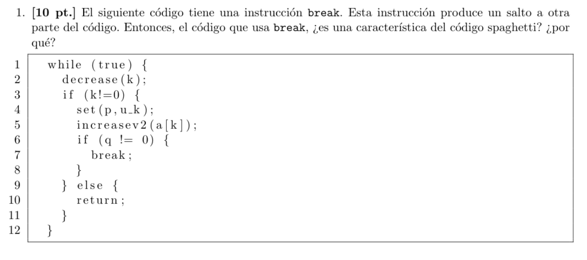
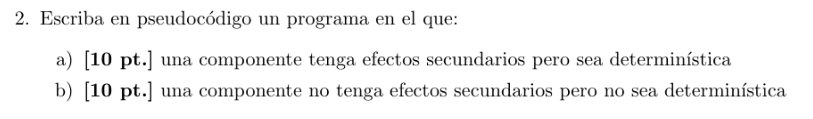
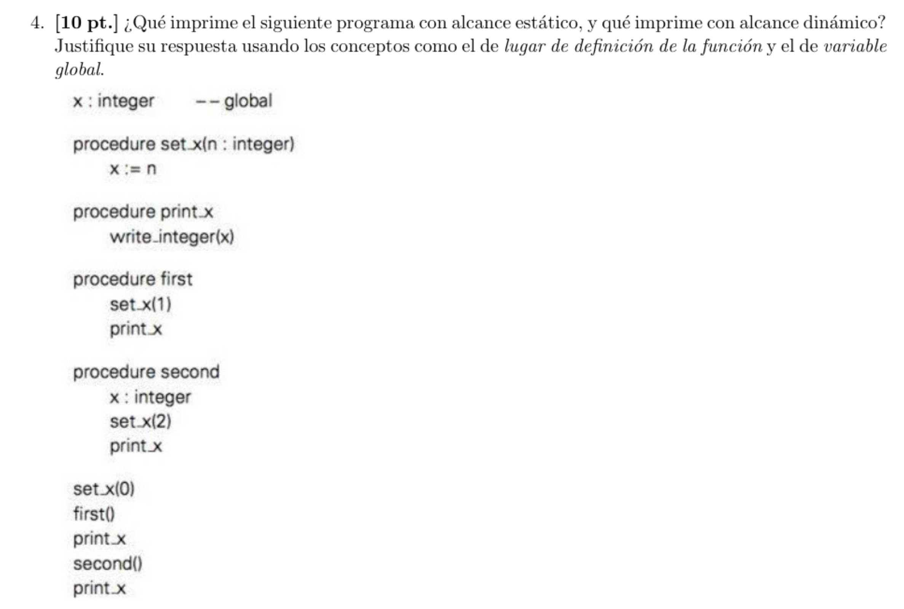
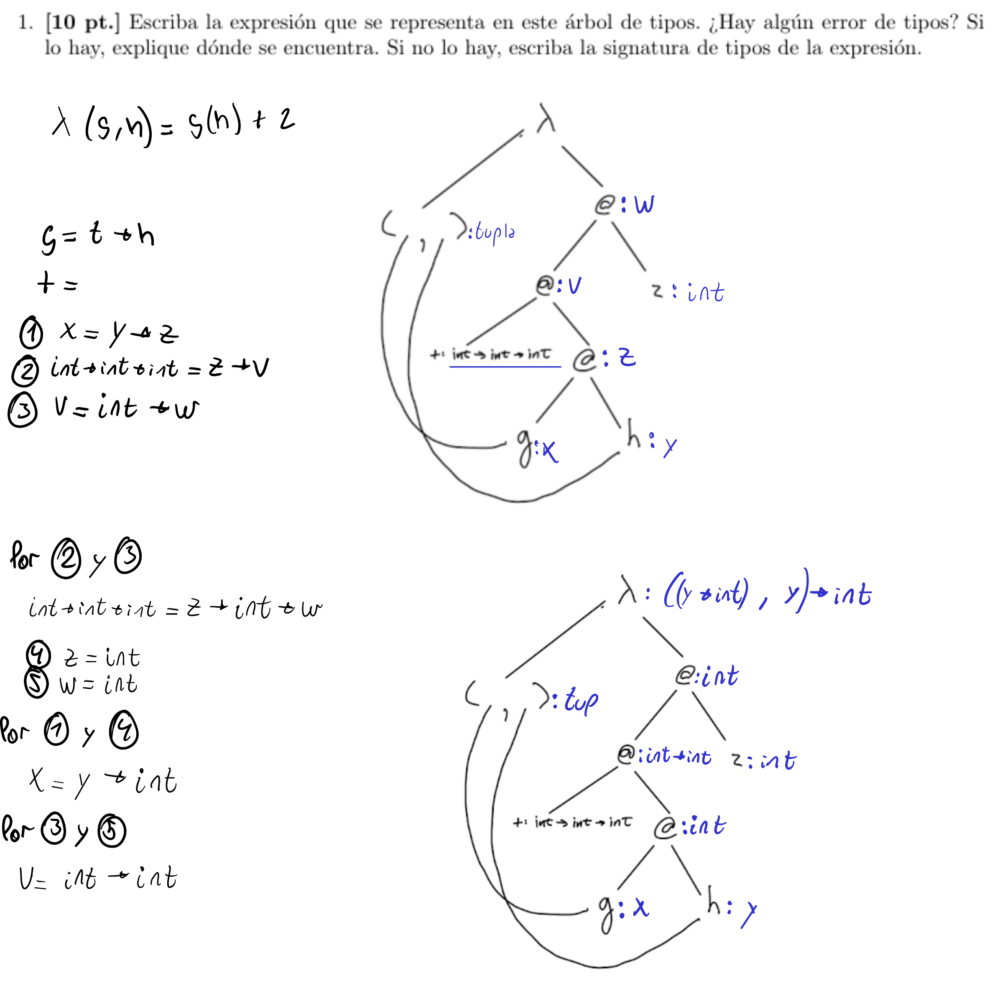
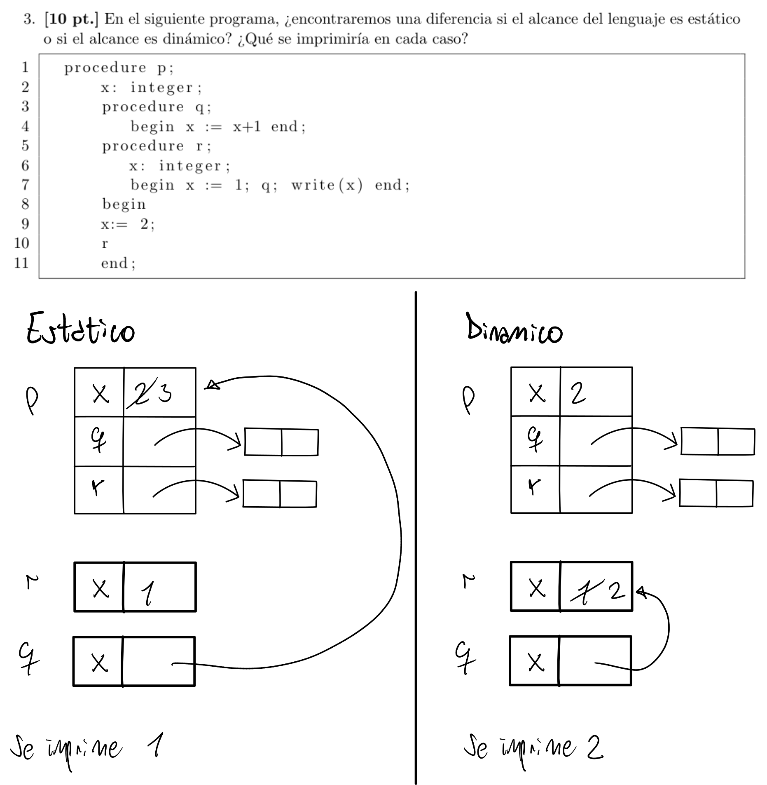
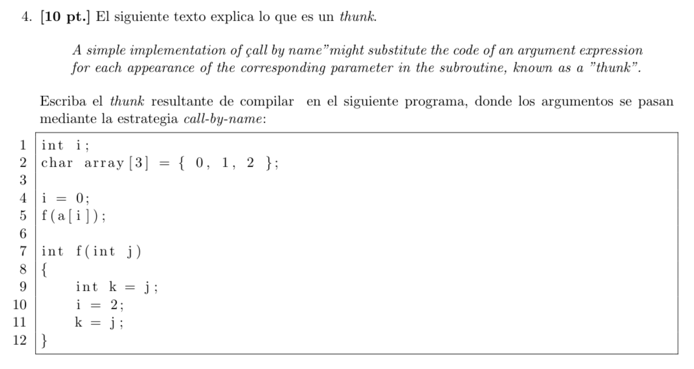
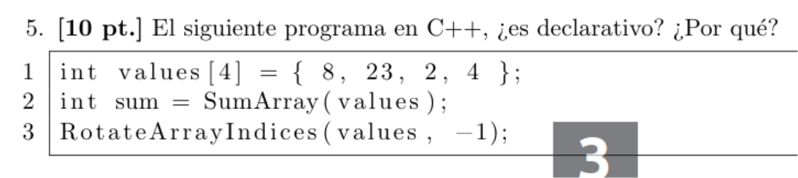
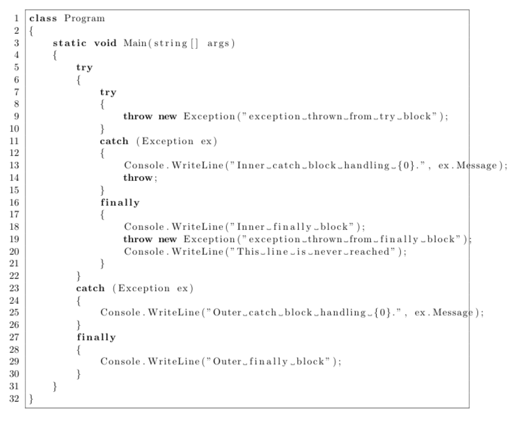
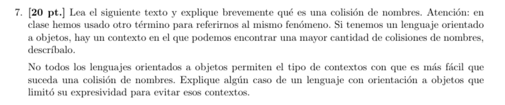
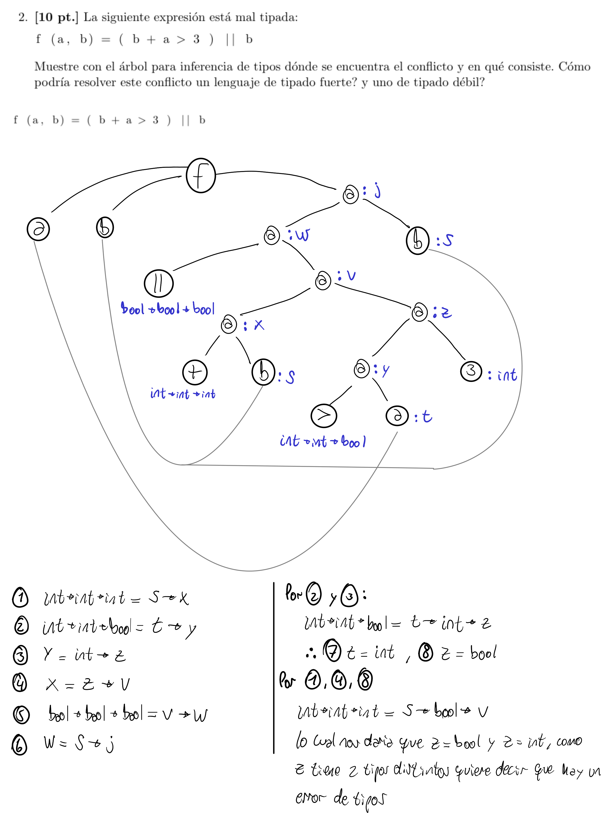

# Parcial 1 2022-06-23.pdf
## 1)


El uso de break no es una característica del codigo espaghetti, ya que al usar break no se
produce un salto arbitrario en el el programa, si no que solo se sale del bloque del bucle
que contenia al break.

Usando break es imposible saltar a un bloque que no se había ejecutado previamente, a
diferencia de usar GOTO.

\newpage

## 2)


### a)

Asumiendo pasaje por referencia:
```
proc f(x) {
    x = 2
}
int x = 4
f(x)
print(x)
```
### b)
```
int y = 5
fun f(x) {
    return x+y
}
int x = 3
int res1 = f(x)
y = 8
int res2 = f(x)
print(res1 != res2)
```


## 3) TODO

## 4)


### Estatico

| print | que x se toma |
|:-----:|---------------|
|   1   | global        |
|   1   | global        |
|   2   | global        |
|   2   | global        |

### Dinamico

| print | que x se toma      |
|:-----:|--------------------|
|   1   | global             |
|   1   | global             |
|   2   | definido en second |
|   1   | global             |

### Explicacion

La principal diferencia entre el funcionamiento de los dos alcances se puede ver
en la funcion `second`.
En el alcance estatico, cuando se llama a la funcion `set_x` dentro de second, se toma la
definicion mas cercana a la declaracion de `set_x`, es decir, la variable global.
En cambio, teniendo en cuenta el mismo contexto, en el alcance dinamico el valor de x se toma de la ultima vez que aparecio en el stack, es decir, de cuando se definio la
variable local x adentro de `second`, por lo cual no se modifica la variable global y
una vez se sale de la funcion `second` se tiene que el valor de la x global sigue siendo 1.

## 5)


## 6)
### Explicacion
Se entra al primer bloque try, se entra al try anidado, se levanta una excepcion, esta excepcion es manejada por el catch del try anidado, se imprime `Inner_catch_block ...`, se ejecuta el bloque del finally, se imprime `Inner_finally_block`.

Como la excepcion lanzada no fue manejada no se ejecuta el catch del
primer try.
Como el finally siempre se ejecuta se imprime `Outer_finally_block`

### Todo lo que se imprime
```
Inner_catch_block...
Inner_finally_block
Outer_finally_block
```

# Parcial 1 2022-
## 1)

jkjkj

## 2)

No, el uso de break no es una característica del codigo spaghetti,
ya que al ejecutarse el break se sale del bloque del bucle hacia
un bloque previamente visitado, a diferencia de por ejemplo un GOTO,
que salta arbitrariamente a una linea especifica, modificando el flujo
normal del programa.

## 3)


La principal diferencia que podemos encontrar entre el alcance dinamico y el
alcance estatico la podemos ver en el procedimiento `q`.

Utilizando alcance estatico, se busca el valor para una variable libre en la
ubicacion mas cercana a la definicion de la funcion, por lo cual la variable `x`
dentro de `q` hace referencia a la variable global `x`.

Por otro lado, para determinar el valor de una variable libre en el alcance
dinamico se busca en la ultima aparicion de esa variable en el stack.
Por lo cual, el `x` en el procedimiento `q` termina referenciando al `x` local
definido dentro de `r`, ya que `r` fue quien llamó a `q`.

## 4)


```
int f(int a[i])
{
    int k = a[i];
    i = 2;
    k = a[i];
}
```

## 5)


No, no es declarativo, ya que segun como es utilizado `RotateArrayIndices`
y por su nombre podemos intuir que recibe un array de valores y mueve el contenido
de todo indice i a la posicion i-1, modificando así el array.
Por lo cual, como modifica el array que se le pasa como argumento, quiere decir que produce
efectos secundarios.
Y como produce efectos secundarios podemos concluir que no es declarativo.

\newpage

## 6)



Se entra al bloque del primer try; se entra al bloque del try anidado;
el try anidado lanza una excepcion; la excepcion es manejada por el catch del try anidado;
Se ejecuta el bloque del finally del try anidado; se lanza una nueva excepcion;
El catch del primer try maneja la excepcion lanzada en el finally del try anidado;
Se ejecuta el bloque del finally del primer try;

\newpage

## 7)



Una colision de nombres sucede cuando hay mas de un metodo o funcion
con el mismo nombre y el compilador no sabe a que elemento se está haciendo
referencia, por lo cual produce un error.

El contexto en el que podemos encontrar una mayor colision de nombres es cuando
se utiliza herencia multiple, ya que al heredar de varias clases es mas probable
que se repita el nombre de alguna funcion.

Un lenguaje que limito su expresividad para evitar estos contextos es Java.
El cual no permité la herencia multiple, si no que utiliza clases abstractas sin
implementacion llamadas interfaces.
Al no tener implementacion no seria gran problema que se utilicen dos interfaces
con los mismos metodos, y por ende no habria problemas de colision.

# Parcial 1 2019-06-18.pdf
## 2)


Un lenguaje de tipado fuerte probablemente produzca un error.

Un lenguaje de tipado debil seguro haria un casteo de bool a int si se suma
con un booleano o de int a bool, si se le hace un OR.
