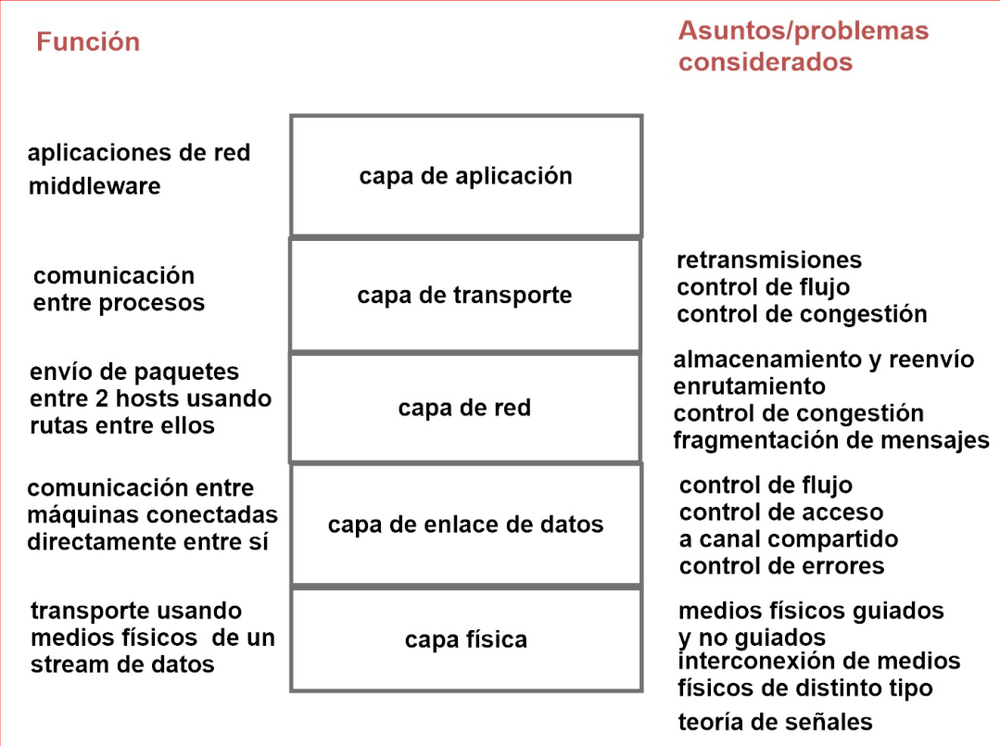

# Introducción a las Redes de Computadoras – Parte 1
<!-- from 02-introducción - parte 1 (Primer intento)_HIGHEXT.md -->

## ¿Qué tipos de máquinas queremos poder interconectar por medio de redes?
<!-- from 02-introducción - parte 1 (Primer intento)_HIGHEXT.md -->

### Hosts o sistemas finales:
<!-- from 02-introducción - parte 1 (Primer intento)_HIGHEXT.md -->
dispositivos de cómputo

Incluye: distintos tipos de computadoras

y dispotitivos IoT

### “Fun” Internet-connected devices
<!-- from 02-introducción - parte 1 (Primer intento)_HIGHEXT.md -->

Web-enabled toaster + weather forecaster

IP picture frame

Tweet-a-watt: monitor energy use

Internet refrigerator

Pet tracking
Smart lighting

## Dispositivos IoT
<!-- from 02-introducción - parte 1 (Primer intento)_HIGHEXT.md -->

### Dispositivos IoT pueden:
<!-- from 02-introducción - parte 1 (Primer intento)_HIGHEXT.md -->

Intercambiar datos con otros dispositivos y aplicaciones interconectados.

Recolectar datos de otros dispositivos y procesar los datos localmente o enviarlos a servidores centralizados para procesar los datos.

Realizar algunas tareas localmente y otras tareas dentro de la infraestructura de la red

## Redes de Computadoras
<!-- from 02-introducción - parte 1 (Primer intento)_HIGHEXT.md -->

### ¿Qué es una red de computadoras?
<!-- from 02-introducción - parte 1 (Primer intento)_HIGHEXT.md -->

Una red de computadoras es un conjunto de sistemas finales interconectados.

#### ¿Qué significa que dos computadoras están interconectadas?\
<!-- from 02-introducción - parte 1 (Primer intento)_HIGHEXT.md -->

Dos computadoras

están interconectadas si pueden intercambiar información.

#### ¿De qué manera puede hacerse la interconexión?\
<!-- from 02-introducción - parte 1 (Primer intento)_HIGHEXT.md -->
La conexión puede hacerse por
**medios de transmisión:**

cable de cobre, fibra óptica, microondas, etc.

El intercambio de información entre hosts se hace por medio de
**señales**
que viajan en los medios de transmisión.

### ¿Qué servicios o usos proporcionan las redes de computadoras?
<!-- from 02-introducción - parte 1 (Primer intento)_HIGHEXT.md -->
Compartir recursos:

medio de comunicación entre personas:

Socializar:

Trabajo colaborativo

Comercio electrónico
Entretenimiento:

### ¿Qué hacer para que los hosts de varias redes de distinto tipo se puedan comunicar entre sí?
<!-- from 02-introducción - parte 1 (Primer intento)_HIGHEXT.md -->
Varias redes de computadoras pueden ser
**interconectadas**

entre sí para formar redes más grandes.

La
**internet**
es el ejemplo de red de redes más grande.

## Sistemas Operativos de Red
<!-- from 02-introducción - parte 1 (Primer intento)_HIGHEXT.md -->

Para poder aprovechar y gestionar los distintos tipos de redes se definen
**sistemas operativos de red.**

## Aplicaciones de Red
<!-- from 02-introducción - parte 1 (Primer intento)_HIGHEXT.md -->

Las redes de computadora se usan para proveer distintos
**servicios:**

Para proveer servicios se crean

**aplicaciones de red.**
Para programarlas se usan

**APIs y middlewares.**

Y estos últimos se basan en el sistema operativo de red.

## Interredes
<!-- from 02-introducción - parte 1 (Primer intento)_HIGHEXT.md -->

### ¿Cómo comunicar personas pertenecientes a redes diferentes?
<!-- from 02-introducción - parte 1 (Primer intento)_HIGHEXT.md -->

#### Solución:\
<!-- from 02-introducción - parte 1 (Primer intento)_HIGHEXT.md -->
usar interredes

#### Interred\
<!-- from 02-introducción - parte 1 (Primer intento)_HIGHEXT.md -->
conjunto de redes interconectadas

#### puertas de enlace:\
<!-- from 02-introducción - parte 1 (Primer intento)_HIGHEXT.md -->

conectan redes de distintas tecnologías.

#### Internet\
<!-- from 02-introducción - parte 1 (Primer intento)_HIGHEXT.md -->
es una interred.

## La Internet
<!-- from 02-introducción - parte 1 (Primer intento)_HIGHEXT.md -->

La
**internet**

está formada por billones de dispositivos de computación conectados entre sí.

En la internet se ejecutan
**aplicaciones de red.**

La internet es una red de redes que interconecta varias redes entre sí.

Para envío y recepción de mensajes entre sistemas finales se usan
**protocolos.**

### Estructura de la Internet
<!-- from 02-introducción - parte 1 (Primer intento)_HIGHEXT.md -->

Hosts acceden a la internet a través de

**proveedores de servicios de internet de acceso**

#### ¿Qué tipos de ISP de acceso existen?\
<!-- from 02-introducción - parte 1 (Primer intento)_HIGHEXT.md -->

**ISP residenciales**
(p.ej. compañías de cable, telefónicas,

**ISP empresarial**
(da acceso a sus empleados).

**ISPs universitaria**
(da acceso a docentes, estudiantes y personal).

Celulares.

**ISPs que proveen acceso a WiFI**
en aeropuertos, hoteles, restaurantes,

### ISPs de capa superior
<!-- from 02-introducción - parte 1 (Primer intento)_HIGHEXT.md -->

### redes proveedoras de contenido
<!-- from 02-introducción - parte 1 (Primer intento)_HIGHEXT.md -->

### ¿Qué redes tenemos en cada nivel de la jerarquía?
<!-- from 02-introducción - parte 1 (Primer intento)_HIGHEXT.md -->

## Internet de las Cosas (IoT)
<!-- from 02-introducción - parte 1 (Primer intento)_HIGHEXT.md -->

### ¿Qué es el IoT?
<!-- from 02-introducción - parte 1 (Primer intento)_HIGHEXT.md -->

### paradigmas de redes anteriores
<!-- from 02-introducción - parte 1 (Primer intento)_HIGHEXT.md -->

## Redes de área amplia (WANs)
<!-- from 02-introducción - parte 1 (Primer intento)_HIGHEXT.md -->

### red de área amplia (WAN)
<!-- from 02-introducción - parte 1 (Primer intento)_HIGHEXT.md -->

### cómo está organizada una WAN?
<!-- from 02-introducción - parte 1 (Primer intento)_HIGHEXT.md -->

### ¿Cómo se hace para enviar mensajes en una WAN?
<!-- from 02-introducción - parte 1 (Primer intento)_HIGHEXT.md -->

### Encolado y pérdida de paquetes
<!-- from 02-introducción - parte 1 (Primer intento)_HIGHEXT.md -->

### Algoritmos de enrutamiento
<!-- from 02-introducción - parte 1 (Primer intento)_HIGHEXT.md -->

### ¿Cuánto demora el almacenamiento y reenvío?
<!-- from 02-introducción - parte 1 (Primer intento)_HIGHEXT.md -->

### Sistema telefónico fijo (p.ej. DSL):
<!-- from 02-introducción - parte 1 (Primer intento)_HIGHEXT.md -->

### Arquitectura de red celular
<!-- from 02-introducción - parte 1 (Primer intento)_HIGHEXT.md -->

### Sistema de fibra a la casa:
<!-- from 02-introducción - parte 1 (Primer intento)_HIGHEXT.md -->

## Redes de Área Metropolitana (MAN)
<!-- from 02-introducción - parte 1 (Primer intento)_HIGHEXT.md -->

### tipos:
<!-- from 02-introducción - parte 1 (Primer intento)_HIGHEXT.md -->

### MAN basada en TV por cable
<!-- from 02-introducción - parte 1 (Primer intento)_HIGHEXT.md -->

### Access net: cable network
<!-- from 02-introducción - parte 1 (Primer intento)_HIGHEXT.md -->

## Redes de Área Local
<!-- from 02-introducción - parte 1 (Primer intento)_HIGHEXT.md -->

### ¿Dónde puede usarse una LAN?
<!-- from 02-introducción - parte 1 (Primer intento)_HIGHEXT.md -->

### ¿Qué tipos de hosts se comunican a una LAN?
<!-- from 02-introducción - parte 1 (Primer intento)_HIGHEXT.md -->

### tipos de LAN:
<!-- from 02-introducción - parte 1 (Primer intento)_HIGHEXT.md -->

### Difusión:
<!-- from 02-introducción - parte 1 (Primer intento)_HIGHEXT.md -->

### ¿A quién puede estar destinado un mensaje cuando se usa difusión?¿Qué
<!-- from 02-introducción - parte 1 (Primer intento)_HIGHEXT.md -->

### Red hogareña
<!-- from 02-introducción - parte 1 (Primer intento)_HIGHEXT.md -->

### Internet
<!-- from 02-introducción - parte 1 (Primer intento)_HIGHEXT.md -->

## Protocolos
<!-- from 02-introducción - parte 1 (Primer intento)_HIGHEXT.md -->

### Protocolos de comunicación definen:
<!-- from 02-introducción - parte 1 (Primer intento)_HIGHEXT.md -->

## La Internet
<!-- from 02-introducción - parte 1 (Segundo intento)_HIGHEXT.md -->

### La internet
<!-- from 02-introducción - parte 1 (Segundo intento)_HIGHEXT.md -->

está formada por billones de dispositivos de computación conectados entre sí.

En la internet se ejecutan
**aplicaciones de red.**

La internet es una red de redes que interconecta varias redes entre sí.

Para envío y recepción de mensajes entre sistemas finales se usan
**protocolos.**

### Estructura de la Internet
<!-- from 02-introducción - parte 1 (Segundo intento)_HIGHEXT.md -->

Hosts acceden a la internet a través de

**proveedores de servicios de internet de acceso**
(ISPs de acceso).

#### ¿Qué tipos de ISP de acceso existen?
<!-- from 02-introducción - parte 1 (Segundo intento)_HIGHEXT.md -->
\

**ISP residenciales**
compañías de cable, telefónicas, fibra a la casa (FTTH), etc.).

**ISP empresarial**
(da acceso a sus empleados).

**ISPs universitaria**
(da acceso a docentes, estudiantes y personal).

**Celulares.**

**ISPs que proveen acceso a WiFI**
(p.ej. en aeropuertos, hoteles, restaurantes, etc.

Las ISP de acceso son interconectadas a través de redes ISP nacionales e internacionales de más alto nivel llamados

### ISPs de capa superior
<!-- from 02-introducción - parte 1 (Segundo intento)_HIGHEXT.md -->
o globales de tránsito.
son ISP que proveen
**servicios de tránsito.**
Una ISP de capa superior consiste de
**enrutadores de alta velocidad**

interconectados con
**enlaces de fibra óptica**
de alta velocidad.

Las ISP globales de tránsito deben estar interconectadas entre sí.

Cada red ISP, ya sea de acceso o de capa superior, es manejada independientemente.

### redes proveedoras de contenido
<!-- from 02-introducción - parte 1 (Segundo intento)_HIGHEXT.md -->
(por ejemplo, Google, Facebook, Microsoft, Apple, etc.).

#### ¿Por qué se usan
<!-- from 02-introducción - parte 1 (Segundo intento)_HIGHEXT.md -->
\

Para reducir pagos a redes de tránsito global.

Para tener control sobre cómo sus servicios son entregados a los usuarios finales.

#### ¿A qué redes se conectan
<!-- from 02-introducción - parte 1 (Segundo intento)_HIGHEXT.md -->
\

A ISP regionales e ISP de acceso.

### ¿Qué redes tenemos en cada nivel de la jerarquía?
<!-- from 02-introducción - parte 1 (Segundo intento)_HIGHEXT.md -->

**“tier-1” ISPs comerciales**

(p.ej. redes globales de tránsito) cobertura nacional e internacional.

**Redes proveedoras de contenido**
En el medio
**ISP regionales.**
**Finalmente ISPs de acceso**

## Internet de las Cosas (IoT)
<!-- from 02-introducción - parte 1 (Segundo intento)_HIGHEXT.md -->

### ¿Qué es el IoT?
<!-- from 02-introducción - parte 1 (Segundo intento)_HIGHEXT.md -->

es extender Internet desde “computadoras” a “objetos”, sin necesidad de un “humano” en el medio.

### IOT nace de paradigmas de redes anteriores
<!-- from 02-introducción - parte 1 (Segundo intento)_HIGHEXT.md -->

#### Machine-to-Machine (M2M):
<!-- from 02-introducción - parte 1 (Segundo intento)_HIGHEXT.md -->
\
redes para conectar máquinas entre sí.

#### Radio-Frequency ID (RFID):
<!-- from 02-introducción - parte 1 (Segundo intento)_HIGHEXT.md -->
\
para chips embebidos en productos que hacen saltar alarmas en locales.

#### Wireless Sensor Networks (WSN):
<!-- from 02-introducción - parte 1 (Segundo intento)_HIGHEXT.md -->
\
sensores distribuidos conectados a una red.

#### Mobile Ad-Hoc Networks (MANET):
<!-- from 02-introducción - parte 1 (Segundo intento)_HIGHEXT.md -->
\
redes de autos que se comunican entre ellos.

#### Domótica (Smart home):
<!-- from 02-introducción - parte 1 (Segundo intento)_HIGHEXT.md -->
\

dispositivos hogareños conectados en red Ciudades, rural (Smart cities)

#### Vehículos
<!-- from 02-introducción - parte 1 (Segundo intento)_HIGHEXT.md -->
\
(Vehicle to everything)

#### Industria (Industria 4.0):
<!-- from 02-introducción - parte 1 (Segundo intento)_HIGHEXT.md -->
\

se conectan dispositivos en sistema productivo, en una fábrica.

#### Cyber-physical systems (CPS)
<!-- from 02-introducción - parte 1 (Segundo intento)_HIGHEXT.md -->
\

## Redes de área amplia (WANs)
<!-- from 02-introducción - parte 1 (Segundo intento)_HIGHEXT.md -->

### red de área amplia (WAN)
<!-- from 02-introducción - parte 1 (Segundo intento)_HIGHEXT.md -->

cubre un área geográfica grande, típicamente un país o hasta un continente.
Una red de área amplia va a permitir interconectar varias redes hogareñas e institucionales

### ¿Cómo se hace para enviar mensajes en una WAN?
<!-- from 02-introducción - parte 1 (Segundo intento)_HIGHEXT.md -->

**Algoritmo de almacenamiento y –reenvío.**
–reenvío. Un paquete sigue una ruta de enrutadores.

El paquete se almacena enteramente en cada enrutador de la ruta.

El paquete almacenado en un enrutador espera allí hasta que la línea requerida de salida esté libre y luego se reenvía al siguiente enrutador.

### Encolado y pérdida de paquetes
<!-- from 02-introducción - parte 1 (Segundo intento)_HIGHEXT.md -->

Si la tasa de llegada al enlace (en bits) excede la tasa de transmisión del enlace por un período de tiempo.

**¿Qué va a suceder?**

Los paquetes se van a encolar, y esperarán a ser transmitidos en el enlace.

Los paquetes pueden ser descartados (perdidos) si la memoria (el búfer) se llena.

### ¿Cuánto demora el almacenamiento y reenvío?
<!-- from 02-introducción - parte 1 (Segundo intento)_HIGHEXT.md -->

dnodal = dproc + dqueue + dtrans + dprop

dproc: procesamiento del nodo

dqueue: demora por encolado

Chequeo de errores

dqueue: Tiempo de espera en el enlace de salida para transmisión.

Determinar la línea de salida

typically < msec

Depende de cuán congestionado está el enrutador

### •Sistema telefónico fijo (p.ej. DSL):
<!-- from 02-introducción - parte 1 (Segundo intento)_HIGHEXT.md -->
•Sistema Cada domicilio está conectado por un cable de cobre a una
**End office**

Toda oficina central está conectada a una
**Toll office.**

**Toll offices**
son usadas para reenvío de mensajes.

**Toll offices**
unidas por cables (de fibra óptica).

## Redes de Área Metropolitana (MAN)
<!-- from 02-introducción - parte 1 (Segundo intento)_HIGHEXT.md -->

Una
**red de área metropolitana (MAN)**

cubre una ciudad.

### tipos:
<!-- from 02-introducción - parte 1 (Segundo intento)_HIGHEXT.md -->

#### Redes de cable:
<!-- from 02-introducción - parte 1 (Segundo intento)_HIGHEXT.md -->
\

se basan en la red de TV por cable.

#### Redes móbiles:
<!-- from 02-introducción - parte 1 (Segundo intento)_HIGHEXT.md -->
\

son redes inalámbricas de alta velocidad.

## Redes de Área Local
<!-- from 02-introducción - parte 1 (Segundo intento)_HIGHEXT.md -->

Una
**red de área local**

(LAN) es una red operada privadamente dentro de un edificio o casa.

### ¿Dónde puede usarse una LAN?
<!-- from 02-introducción - parte 1 (Segundo intento)_HIGHEXT.md -->

Una LAN puede usarse en un hogar o en una organización (pública o privada).

Las LAN usadas por compañías se llaman

**redes empresariales.**

### ¿Qué tipos de hosts se comunican a una LAN?
<!-- from 02-introducción - parte 1 (Segundo intento)_HIGHEXT.md -->

Las LAN se usan para comunicar PCs, notebooks, celulares, impresoras, electrónicos del hogar, etc.

La idea es que los hosts puedan compartir recursos e intercambiar información.

### tipos de LAN:
<!-- from 02-introducción - parte 1 (Segundo intento)_HIGHEXT.md -->

#### LAN inalámbricas:
<!-- from 02-introducción - parte 1 (Segundo intento)_HIGHEXT.md -->
\
en su forma más simple las máquinas se comunican entre sí
por medio de una estación base (access point).

#### La Ethernet:
<!-- from 02-introducción - parte 1 (Segundo intento)_HIGHEXT.md -->
\
las máquinas se conectan por medio de cables a un commutador (switch).

### Difusión:
<!-- from 02-introducción - parte 1 (Segundo intento)_HIGHEXT.md -->

Si una máquina envía un mensaje, todas las demás lo reciben.

### ¿A quién puede estar destinado un mensaje cuando se usa difusión?¿Qué
<!-- from 02-introducción - parte 1 (Segundo intento)_HIGHEXT.md -->
Estar destinado a una única máquina
Ser enviado a todas las máquinas (broadcasting)

Ser enviado a un grupo de máquinas en particular (multicasting)

### Colisión:
<!-- from 02-introducción - parte 1 (Segundo intento)_HIGHEXT.md -->

más de una máquina manda simultáneamente un mensaje.
Los mensajes colisionan y se dañan.

#### ¿Qué hay que hacer en relación a las colisiones?
<!-- from 02-introducción - parte 1 (Segundo intento)_HIGHEXT.md -->
\
Evitar o minimizar colisiones.
Detectar las colisiones
Tratar las colisiones

### Redes de acceso empresarial
<!-- from 02-introducción - parte 1 (Segundo intento)_HIGHEXT.md -->

## Internet
<!-- from 02-introducción - parte 1 (Segundo intento)_HIGHEXT.md -->

Red dorsales (backbone) están conectadas a varias WAN

Redes metropolitanas pueden conectarse a WANs

LANs están conectadas a WANs o a redes metropolitanas

## Protocolos
<!-- from 02-introducción - parte 1 (Segundo intento)_HIGHEXT.md -->

### Protocolos de comunicación definen:
<!-- from 02-introducción - parte 1 (Segundo intento)_HIGHEXT.md -->
**formato,**

**orden**
de
**mensajes enviados y recibidos**
entre máquinas de la red, y
**acciones tomadas**

# Sistemas Operativos de Redes
<!-- from 02-introducción - parte 2_HIGHEXT.md -->

## sistemas operativos de redes (SOR)
<!-- from 02-introducción - parte 2_HIGHEXT.md -->

están organizadas como una
**pila de capas o niveles,**
cada una construida arriba de la que está debajo de ella.

La cantidad de capas, los nombres de las capas, sus contenidos y su función, difieren de un tipo de red a otro.

## Jerarquías de Protocolos
<!-- from 02-introducción - parte 2_HIGHEXT.md -->

### propósito de una capa en arquitecturas multicapa?
<!-- from 02-introducción - parte 2_HIGHEXT.md -->
ofrecer ciertos servicios a las capas superiores
ocultar la implementación a las capas superiores

### Interfaces entre capas
<!-- from 02-introducción - parte 2_HIGHEXT.md -->
operaciones y servicios primitivos ofrecidos por una capa a capa superior.

### propósito de las capas?
<!-- from 02-introducción - parte 2_HIGHEXT.md -->

Una capa n se piensa como una conversación entre la capa n de una máquina con la capa n de otra máquina,

### comunicaciones entre capas consecutivas?
<!-- from 02-introducción - parte 2_HIGHEXT.md -->

#### Durante el envío de mensaje:
<!-- from 02-introducción - parte 2_HIGHEXT.md -->
\

cada capa pasa los datos y la información de control a la capa inmediatamente inferior, hasta que se alcanza la capa más baja.

#### Durante la recepción de mensaje:
<!-- from 02-introducción - parte 2_HIGHEXT.md -->
\

cada capa pasa cierta información conteniendo los datos a la capa inmediatamente superior hasta que alcanza la capa más alta.

## cómo funcionan las capas para el envío de mensajes.
<!-- from 02-introducción - parte 2_HIGHEXT.md -->

### (capa 5 o capa de aplicación)
<!-- from 02-introducción - parte 2_HIGHEXT.md -->

Produce un mensaje y lo pasa a la capa 4 para su transmisión.

### •La capa 4 (capa de transporte)
<!-- from 02-introducción - parte 2_HIGHEXT.md -->
•La pone un encabezado en el mensaje para identificarlo y pasa el resultado a la capa 3.

#### El encabezado
<!-- from 02-introducción - parte 2_HIGHEXT.md -->
\
contiene
**números de secuencia**
para que la capa 4 en la máquina de destino entregue los mensajes en el orden correcto.

### •Capa 3 (capa de red):
<!-- from 02-introducción - parte 2_HIGHEXT.md -->
Hay limitaciones en el tamaño de los mensajes de capa 3.

Divide en
**paquetes**
los mensajes que llegan.

A cada paquete se le coloca un encabezado.

Decide cuál de las líneas que salen usar

Pasa los paquetes a la capa 2.

### •La capa 2 (capa de enlace de datos)
<!-- from 02-introducción - parte 2_HIGHEXT.md -->
agrega un encabezado y un terminador, a cada pieza

pasa la unidad resultante a la capa 1 para su transmisión.

## problemas de diseño
<!-- from 02-introducción - parte 2_HIGHEXT.md -->

### mecanismo para identificar a las máquinas de una red.
<!-- from 02-introducción - parte 2_HIGHEXT.md -->

Se usan direcciones para las máquinas.

### Control de flujo:
<!-- from 02-introducción - parte 2_HIGHEXT.md -->

#### evitar que un emisor rápido sature de datos a un receptor
<!-- from 02-introducción - parte 2_HIGHEXT.md -->
\

Uso de

**retroalimentación al emisor.**

O sea, indicarle cuándo y cuánto puede enviar.

### Fragmentación de mensajes
<!-- from 02-introducción - parte 2_HIGHEXT.md -->

Es común que las capas imponen un tamaño máximo a los mensajes.

los procesos son incapaces de aceptar mensajes que superan una cierta longitud

#### ejemplo
<!-- from 02-introducción - parte 2_HIGHEXT.md -->
\
en la capa de enlace de datos y en la capa de red

en una inter-red

#### tratar un mensaje demasiado largo?
<!-- from 02-introducción - parte 2_HIGHEXT.md -->
\

fragmentar mensajes, transmitir fragmentos y re-ensamblar mensajes.

### congestión
<!-- from 02-introducción - parte 2_HIGHEXT.md -->

La red no puede manejar la carga de paquetes que recibe de manera aceptable

#### controlar la congestión?
<!-- from 02-introducción - parte 2_HIGHEXT.md -->
\

que máquinas emisoras se enteren de la congestión y reduzcan el tráfico de salida.

# tipos de capas
<!-- from 02-introducción - parte 2_HIGHEXT.md -->

## Capa de aplicación
<!-- from 02-introducción - parte 2_HIGHEXT.md -->

En la capa de aplicación tenemos las

**aplicaciones de red.**

### aplicación de red
<!-- from 02-introducción - parte 2_HIGHEXT.md -->

ofrece un servicio específico con su propia forma de interfaz con el usuario.

### opciones para desarrollar aplicaciones de red:
<!-- from 02-introducción - parte 2_HIGHEXT.md -->

#### (API).
<!-- from 02-introducción - parte 2_HIGHEXT.md -->
\
Una API es conjunto básico de funciones a ser usadas.

La socket API es el estándar de facto para el software que se comunica sobre la internet.

#### middlewares
<!-- from 02-introducción - parte 2_HIGHEXT.md -->
\

provee servicios al software de la •aplicación que
•aplicación hacen más fácil a los desarrolladores implementar la comunicación y la entrada/salida de modo que

se pueden enfocar en el propósito específico de la aplicación.

### TCP/IP
<!-- from 02-introducción - parte 2_HIGHEXT.md -->

La
**capa de aplicación**

en TCP/IP contiene varios protocolos de nivel mas alto:
transferencia de archivos (FTP), correo electrónico (SMTP),
resolución de nombres de host en sus direcciones de red (DNS),
páginas web (HTTP), etc.

## Capa de transporte
<!-- from 02-introducción - parte 2_HIGHEXT.md -->

La capa de red provee comunicación entre hosts

La
**capa de transporte**

provee comunicación entre procesos.

La CT mejora los servicios de la CR
La CT se ejecuta por completo en los hosts.

### Entidad de transporte
<!-- from 02-introducción - parte 2_HIGHEXT.md -->

software/hardware de la CT.

### ¿Qué cosas se debería solucionar la CT?
<!-- from 02-introducción - parte 2_HIGHEXT.md -->

Uso de
**temporizadores**
y las
**retransmisiones de paquetes.**
Uso de búferes y control de flujo.

Evitar congestionar la red poniendo demasiados paquetes en ella.

• Cuando la CR pierde paquetes, la CT puede solucionarlo.

### TCP/IP
<!-- from 02-introducción - parte 2_HIGHEXT.md -->

#### TCP
<!-- from 02-introducción - parte 2_HIGHEXT.md -->
\

proporciona entrega confiable y en orden de los mensajes.

Permite que un flujo de bytes que se origina en una máquina se entregue
**sin errores**
en otra máquina en la interred.

**Reensamblaje**
de los mensajes recibidos en el receptor.
TCP también maneja el
**control de flujo**
y
**el control de congestión.**

#### UDP
<!-- from 02-introducción - parte 2_HIGHEXT.md -->
\

Un mensaje puede entregarse con errores, o no entregarse, o varios mensajes pueden entregarse en forma desordenada.

Mensajes recibidos no son confirmados.

#### para que tipo de aplicaciones se puede usar UDP?
<!-- from 02-introducción - parte 2_HIGHEXT.md -->
\

Se

usa para aplicaciones que no usan el control de flujo ni la secuenciación de mensajes. – Uso en consultas de solicitud-respuesta y en aplicaciones de transmisión de voz y video.

## Capa de Red
<!-- from 02-introducción - parte 2_HIGHEXT.md -->

### Objetivos
<!-- from 02-introducción - parte 2_HIGHEXT.md -->

Algoritmos de almacenamiento y reenvío

**Control de congestión.**

Resolver problemas que surgen cuando un mensaje tiene que viajar por redes de distinta tecnología para llegar a destino.

### Enrutamiento
<!-- from 02-introducción - parte 2_HIGHEXT.md -->

¿Cuando hay múltiples rutas entre el origen y el destino cómo elegir la mejor o las mejores?

De esto se encargan los
**algoritmos de enrutamiento**

### TCP/IP
<!-- from 02-introducción - parte 2_HIGHEXT.md -->

#### Capa de interred:
<!-- from 02-introducción - parte 2_HIGHEXT.md -->
\

permite que los hosts inyecten paquetes dentro de cualquier red,

Estos viajan a su destino de manera independiente.

Paquetes pueden llegar en un orden distinto al cual fueron enviados.

las capas mas altas deberán ordenarlos, si se desea una entrega ordenada.

#### ¿Cómo se distingue entre diferentes máquinas
<!-- from 02-introducción - parte 2_HIGHEXT.md -->
\

Direcciones IP

4 números entre 0 y 255 separados por ‘.’

#### ¿Cómo son los paquetes
<!-- from 02-introducción - parte 2_HIGHEXT.md -->
\
**Paquetes IP.**
(tienen su propio formato

#### ¿Cómo se hace el enrutamiento?
<!-- from 02-introducción - parte 2_HIGHEXT.md -->
\
Hay protocolos de enrutamiento: se usan
**OSPF**
y

**BGP**
para enrutamiento de paquetes.

### Procesos en comunicación
<!-- from 02-introducción - parte 2_HIGHEXT.md -->

Los procesos en diferentes hosts se comunican intercambiando
**mensajes**

### Direccionando Procesos
<!-- from 02-introducción - parte 2_HIGHEXT.md -->

**Identificadores de proceso**

incluyen tanto direcciones
**IP**
y número de
**puerto.**

porque muchos procesos pueden estar ejecutándose en el mismo host.

## Capa de Enlace de Datos
<!-- from 02-introducción - parte 2_HIGHEXT.md -->

### Objetivo
<!-- from 02-introducción - parte 2_HIGHEXT.md -->

transformar un medio de transmisión puro en una línea de comunicación que aparezca libre de errores de transmisión.

### problemas de diseño
<!-- from 02-introducción - parte 2_HIGHEXT.md -->

#### Fragmentación de paquetes
<!-- from 02-introducción - parte 2_HIGHEXT.md -->
\

en tramas, cuando un paquete es demasiado grande para ser aceptado por la CED.

Transmisión de las tramas de manera secuencial.

#### Tramas de confirmación de recepción
<!-- from 02-introducción - parte 2_HIGHEXT.md -->
\

son usadas cuando el servicio es confiable.

#### Control de flujo.
<!-- from 02-introducción - parte 2_HIGHEXT.md -->
\

Para evitar que un emisor rápido sature a un receptor lento.

#### Control de acceso a un canal compartido:
<!-- from 02-introducción - parte 2_HIGHEXT.md -->
\

se busca manejar y minimizar o evitar colisiones.

#### Control de errores
<!-- from 02-introducción - parte 2_HIGHEXT.md -->
\

medio físico de comunicaciones es imperfecto y ocasiona errores

## Capa Física
<!-- from 02-introducción - parte 2_HIGHEXT.md -->

### propósito
<!-- from 02-introducción - parte 2_HIGHEXT.md -->

Transportar un stream de datos de una máquina otra usando medios físicos.

### ¿La CF consiste solo de medios físicos?
<!-- from 02-introducción - parte 2_HIGHEXT.md -->

No. Los medios físicos
**se conectan entre sí**

usando dispositivos como codecs, modems, multiplexores, demultiplexores, etc.

### medios físicos
<!-- from 02-introducción - parte 2_HIGHEXT.md -->

**bit:**

**Par trenzado (TP)**

**Enlace físico:**

lo que yace entre el transmisor & receptor

2 cables de cobre aislados

**Medios guiados:**

–Las señales se propagan en medios sólidos: copper, fiber, coax

**Medios no guiados:**

–Las señales se propagan libremente, e.g., radio

**Cable de fibra óptica:**

**coaxial cable:**
**Radio:**

**terrestrial microwave**

**LAN**

**wide-area**

**satellite**

# Protocolos IoT
<!-- from 02-introducción - parte 2_HIGHEXT.md -->

#### 802.15.4 – LR WPAN:
<!-- from 02-introducción - parte 2_HIGHEXT.md -->
\
es una colección de estándares para redes de área personal de tasa de transferencia baja

#### 6LoWPAN:
<!-- from 02-introducción - parte 2_HIGHEXT.md -->
\
trae el protocolo IP a los dispositivos de baja potencia

#### CoAP:
<!-- from 02-introducción - parte 2_HIGHEXT.md -->
\
protocolo para usarse en dispositivos de internet restringidos en recursos

#### Websocket:
<!-- from 02-introducción - parte 2_HIGHEXT.md -->
\
se basa en TCP y permite streams de mensages a ser enviados en ambos sentidos entre cliente y servidor,

#### DDS
<!-- from 02-introducción - parte 2_HIGHEXT.md -->
\

middleware centrado en datos para la comunicación de dispositivo-a-dispositivo or máquina-a-máquina.

#### XMPP
<!-- from 02-introducción - parte 2_HIGHEXT.md -->
\
protocolo para comunicación de tiempo real y streaming de datos XML entre entidades de red.

## Críticas al modelo de referencia TCP/IP
<!-- from 02-introducción - parte 2_HIGHEXT.md -->

No se distingue entre servicio e interfaz.

No se mencionan las capas físicas y de enlace de datos

## Modelo Híbrido
<!-- from 02-introducción - parte 2_HIGHEXT.md -->

\
{ width=250px }

## Cómputo en la Nube (Cloud)
<!-- from 02-introducción - parte 2_HIGHEXT.md -->

### Nube
<!-- from 02-introducción - parte 2_HIGHEXT.md -->

red pública, privada o híbrida que proporciona
**servicios remotos**

Permite la
**manipulación,**
**configuración**
y
**acceso**
a

**recursos**
de hardware y software de forma remota.

### familias de recursos:
<!-- from 02-introducción - parte 2_HIGHEXT.md -->

#### Recursos de procesamiento:
<!-- from 02-introducción - parte 2_HIGHEXT.md -->
\

**Aplicaciones**
(P.ej. Google Docs, Gmail)

**Máquinas virtuales**

**Contenedores:**
(p.ej: Dockers)

#### Recursos de almacenamiento:
<!-- from 02-introducción - parte 2_HIGHEXT.md -->
\

**Almacenamiento de archivos:**
(p.ej. dropbox)

**Almacenamiento de bloques:**

memoria de sistema asociada a las máquinas virtuales.

#### Recursos de infraestructura:
<!-- from 02-introducción - parte 2_HIGHEXT.md -->
\

combinación de elementos de procesamiento y almacenamiento conectados en una red interna virtual

### Servicios
<!-- from 02-introducción - parte 2_HIGHEXT.md -->

#### Infrastructure-as-a-service (IaaS):
<!-- from 02-introducción - parte 2_HIGHEXT.md -->
\

Ambiente formado por recursos centrados en infraestructura que pueden ser accedidos/manejados vía interfaces basadas en servicios de la nube y en herramientas.

P.ej: servidor virtual.

#### Platform-as-a-service (PaaS):
<!-- from 02-introducción - parte 2_HIGHEXT.md -->
\

Ambiente predefinido listo para usarse que se compone de recursos IT configurados y desplegados.

#### Software-as-a-service:
<!-- from 02-introducción - parte 2_HIGHEXT.md -->
\

un programa de software posicionado como un recurso compartido en la nube es hecho disponible como un producto.

El consumidor de la nube tiene un control administrativo muy limitado sobre el programa de software. Usa y configura el servicio.

### Virtualización:
<!-- from 02-introducción - parte 2_HIGHEXT.md -->

Virtualización es el proceso de convertir un recurso IT físico en un recurso IT virtual.

### Containerización:
<!-- from 02-introducción - parte 2_HIGHEXT.md -->

Se empaqueta el código de la aplicación junto con los archivos de configuración relacionados, librerías y dependencias requeridas para que pueda ejecutar.

Este paquete de software o contenedor se abstrae del SO y es portable.

Los contenedores son más pequeños en capacidad que una VM y requieren menos tiempo de inicio.

\newpage

## Convenciones a respetar
<!-- from 02-introducción - parte 2_HIGHEXT.md -->

### B mayúscula
<!-- from 02-introducción - parte 2_HIGHEXT.md -->
= 1 byte = 8 bits (= 2^3 bits)

#### 1KB
<!-- from 02-introducción - parte 2_HIGHEXT.md -->
\
1KB = 2^10 B = 1024 B (=2^13 bits = 8192 bits) kibibyte

#### 1MB
<!-- from 02-introducción - parte 2_HIGHEXT.md -->
\
1MB = 2^20 B = 1.048.576 B

#### 1GB
<!-- from 02-introducción - parte 2_HIGHEXT.md -->
\
1GB = 2^30 B

#### resumen,
<!-- from 02-introducción - parte 2_HIGHEXT.md -->
\
se usan potencias de 2 junto con bytes.

### b minúscula
<!-- from 02-introducción - parte 2_HIGHEXT.md -->
= 1 bit

#### 1Kb
<!-- from 02-introducción - parte 2_HIGHEXT.md -->
\
1Kb = 10^3 b = 1000 b – Kilo bit

#### 1Mb
<!-- from 02-introducción - parte 2_HIGHEXT.md -->
\
1Mb = 10^6 b = 1.000.000 b – Mega bit

#### 1Gb
<!-- from 02-introducción - parte 2_HIGHEXT.md -->
\
1Gb = 10^9 b = 1000.000.000 b – Giga bit

#### resumen,
<!-- from 02-introducción - parte 2_HIGHEXT.md -->
\
se usan potencias de 10 junto con bits.

### velocidades de transmisión:
<!-- from 02-introducción - parte 2_HIGHEXT.md -->

#### 1Kbps
<!-- from 02-introducción - parte 2_HIGHEXT.md -->
\
1Kbps = 13^3 bits por segundo

#### 10Mbps
<!-- from 02-introducción - parte 2_HIGHEXT.md -->
\
10Mbps = 10^6 bps = 10.000.000 bits por segundo

#### 10Gbps
<!-- from 02-introducción - parte 2_HIGHEXT.md -->
\
10Gbps = 10^9 bps

