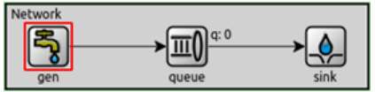
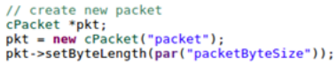
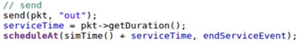
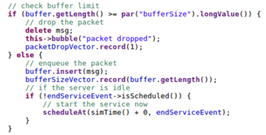
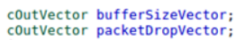
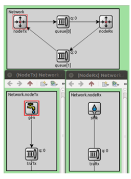
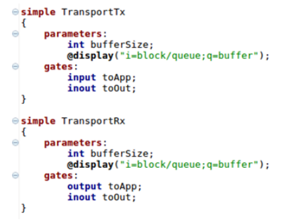

# Modelo de Colas

## modelo de colas
consta de un generador (gen), una cola (queue) y un destino (sink) conectados en una red Network (definida en el archivo .ned).

\
{ width=250px }

## el archivo omnetpp.ini
se configura una simulación de 200s donde gen crea y transmite paquetes con intervalos dados por una distribución exponencial de media configurable, y queue es capaz de atenderlos bajo una misma distribución.

# Tarea Análisis

## La primer tarea
modificar y extender el proyecto para hacer un análisis del impacto de estos parámetros en el tráfico de red.

## Modificaciones en network.ned

### El nodo Generator y Sink
pasarán a ser parte de módulos compuestos denominados nodeTx y nodeRx.
Deberán contener un buffer de transmisión y recepción que se podrá instanciar con el módulo de cola existente.

## casos de estudio

### Caso de estudio 1:

NodeTx a Queue: datarate = 1 Mbps y delay = 100 us

Queue a NodeRx: datarate = 1 Mbps y delay = 100 us

Queue a Sink: datarate = 0.5 Mbps

### Caso de estudio 2:

NodeTx a Queue: datarate = 1 Mbps y delay = 100 us

Queue a NodeRx: datarate = 0.5 Mbps y delay = 100 us

Queue a Sink: datarate = 1 Mbps

## El módulo gen
deberá tomar como parámetro el tamaño del paquete en Bytes (packetByteSize) que tendrá un valor de
**12500 Bytes.**
Los mismos serán generados en intervalos de tiempos exponenciales con media de 100 ms.

## Las queue
serán limitados en tamaño de buffer (bufferSize), expresado en cantidad de paquetes. Se configurará con un valor máximo de 200, salvo la cola del nodo transmisor que se dejará arbitrariamente alta . 2

## Modificaciones en clases de C++

### Los objetos cMessage
no tienen parámetros de tamaño en Bytes.
Se deberá cambiar por objetos cPacket y configurar su tamaño en base al parámetro de configuración correspondiente.

\
{ width=250px }

### El tiempo de servicio
de Queue deberá basarse en la duración de la transmisión del paquete una vez ya encolado

\
{ width=250px }

Se deberá modificar el código de Queue para que controle que el tamaño del buffer no sobrepase el límite configurado.

\
{ width=250px }

### Se deberán agregar nuevas métricas
para el análisis en Queue, una que mida la cantidad de paquetes en el buffer, y otra que mida la cantidad de paquetes descartados por buffer saturado.

\
{ width=250px }

## Experimentos y Preguntas

Se deberá correr simulaciones paramétricas para cada caso de estudio, variando el intervalo de generación de paquetes (generationInterval) entre 0.1 y 1 en los pasos que el grupo crea adecuado para responder las preguntas planteadas.

### Se deberá generar algunas gráficas
de la utilización de cada una de las 3 queue para los caso de estudios planteados.

#### Se sugiere\
crear una gráfica de carga transmitida (eje x) vs. carga recibida (eje y), ambas expresadas en paquetes por segundo
**En caso de que haya pérdidas**
de paquetes también se sugiere medir y comparar estadísticas de ese fenómeno.

### Responda y justifique

1. ¿Qué diferencia observa entre el caso de estudio 1 y 2? ¿Cuál es la fuente limitante en cada uno? Investigue sobre la diferencia entre control de flujo y control de congestión

# Tarea Diseño

## La segunda tarea
es diseñar un sistema de control de flujo y congestión
de manera que se evite la pérdida de datos por saturación de buffers.

## Modificaciones en network.ned

Se deberá agregar un canal de retorno desde el nodeRx al nodeTx para que el receptor pueda acusar información que regule la tasa de transmisión
las queues evolucionarán a un nuevo módulo denominado transportTx y transportRx . 3

\
{ width=250px }
\
{ width=250px }

## Modificaciones en clases de C++

### La modificación más importante

### Considere generar un nuevo tipo de paquete

## Experimentos y Preguntas

# Requisitos del código a entregar
