# Lab 3: Capa de Transporte
## Presentación del problema

### Control de flujo y Control de Congestion

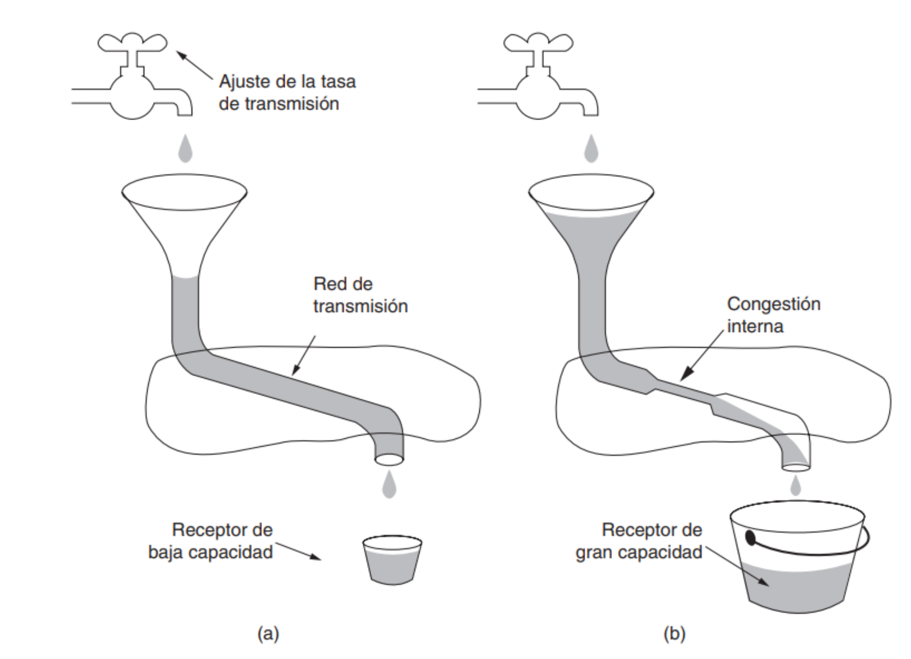{ width=300px }

## Diagnóstico
### Estructura de la red
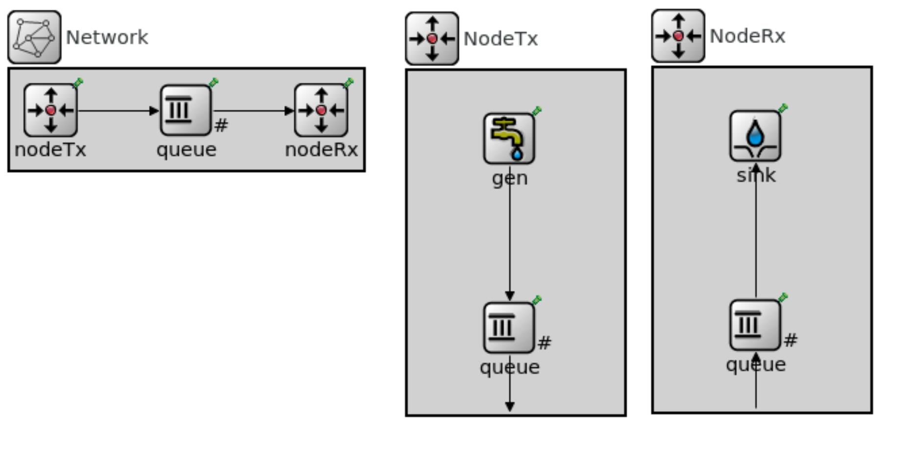

### Casos estudiados
#### Caso 1:
- Se envían paquetes desde un emisor a un receptor a través de una red con un buffer intermedio.
- El emisor envía paquetes a una velocidad mayor a la que el receptor puede procesarlos.
- Este caso es un problema de control de flujo.

#### Caso 2:
- Se envían paquetes desde un emisor a un receptor a través de una red con un buffer intermedio.
- El emisor envía paquetes a una velocidad mayor a la que la red (en este caso el buffer intermedio) puede transmitirlos.
- Este caso es un problema de control de congestión.

### Resultados caso 1
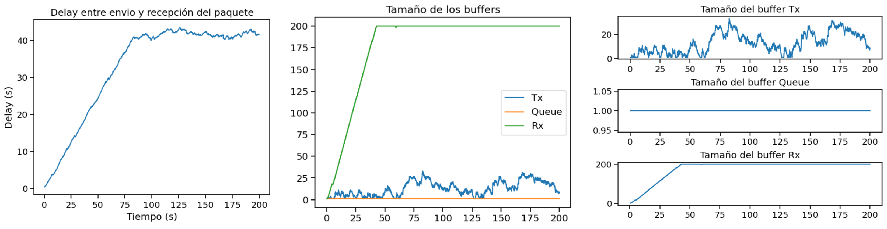

### Resultados caso 2
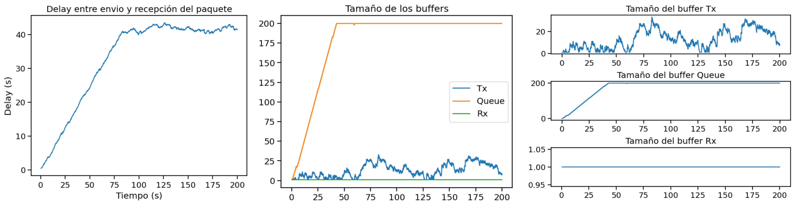

## Propuesta de solución
### Modificaciones a la estructura de la red
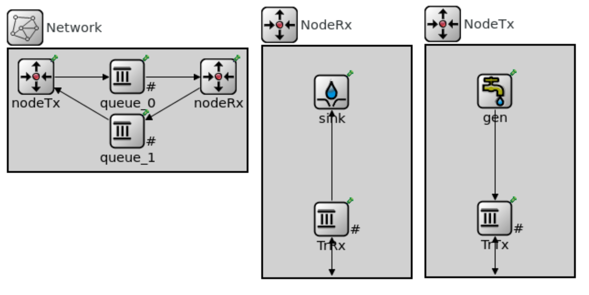

### Algoritmo
- Cuando un nodo de la red detecta que su buffer está casi lleno, envía un aviso al nodo emisor para
que reduzca la tasa de transferencia de paquetes.
- El nodo emisor recibe el aviso y disminuye la tasa a la
mitad.
- Una vez que el nodo que envió el aviso ve que su buffer está en un nivel aceptable, envía
otro aviso al nodo emisor para que aumente la tasa de transferencia.

### Implementacion
- Se añadió un campo bool a las colas queue_0 y TrRx para indicar si se envió un aviso al nodo emisor para disminuir la tasa de transferencia.
- El umbral máximo se estableció en 80% para enviar el aviso de disminución de tasa al nodo emisor.
- El umbral mínimo se fijó en 25% para enviar el aviso de aumento de tasa al nodo emisor.
- Se utiliza la función setKind para cambiar el tipo de paquete enviado al nodo emisor, indicando si debe aumentar o disminuir la tasa de transferencia (paquetes tipo 2 para disminuir y tipo 3 para aumentar).

---

- Los métodos handleMessage de queue_0 y TrRx se modificaron para enviar el aviso al nodo emisor en el momento adecuado.
- Dado que queue_0 no tiene un canal de retroalimentación con el nodo emisor, el aviso se envía a TrRx, que sí tiene dicho canal a través de queue_1. TrRx envía los paquetes tipo 2 o tipo 3 al nodo emisor mediante el canal de retroalimentación.

## Conclusiones y resultados de la solución
### Caso 1

### Caso 2
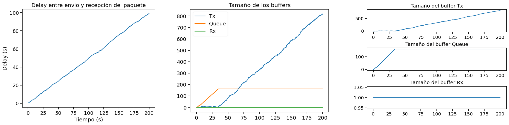

### Posibles mejoras
- Estamos seguros de que existen varios casos donde el protocolo no evita completamente la pérdida de paquetes.
- Nuestro siguiente paso es identificar los casos donde el protocolo no funciona correctamente.
    - A partir de esos casos, podemos continuar mejorando el protocolo.

# Lab 4 - Capa de red

## Presentación problemas
### La capa de red

La capa de red tiene la responsabilidad de tomar los datos recibidos de la capa de transporte y dividirlos en paquetes o datagramas para su transmisión a través de la red. Además, se encarga de determinar la ruta más eficiente para enviar esos paquetes desde el origen hasta el destino final, teniendo en cuenta aspectos como la congestión de la red, el enrutamiento de los paquetes y la selección de los caminos óptimos.

### Enrutamiento en la capa de red

El enrutamiento en redes de computadoras es un problema que se presenta en la capa de red del modelo OSI o TCP/IP. El objetivo es encontrar la ruta más eficiente para enviar paquetes de datos desde el origen al destino. Esto es importante para optimizar el rendimiento de la red y minimizar la cantidad de paquetes demorados o perdidos.

### La estructura de la red

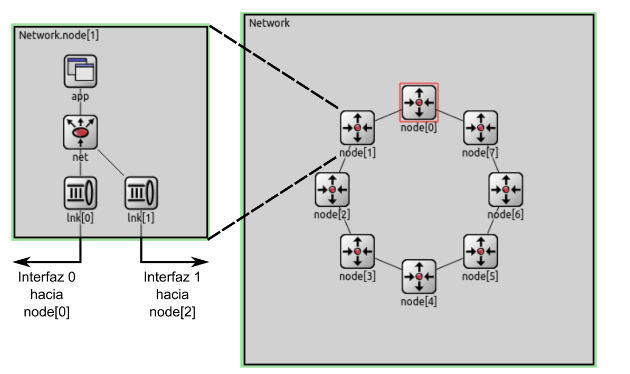

---

En esta red internamente cada nodo cuenta con una capa de aplicación (app) que implementa un generador de tráfico y se encarga de generar y recibir los paquetes, una capa de red (net) que se encarga de el enrutamiento de los paquetes y dos capas de enlace (lnk) que se encargan de enviar los paquetes a los vecinos e implementa un buffer para almacenar los paquetes hasta poder ser enviados

## Diagnostico
### Casos
#### Caso 1
Se envian paquetes de manera regular desde dos nodos (El nodo 0 y el nodo 2) hacia un mismo nodo (El nodo 5).

#### Caso 2
Se envian paquetes de manera regular desde todos los nodos (Excepto el nodo 5) hacia un mismo nodo (El nodo 5).

### Resultados
#### Caso 1

---

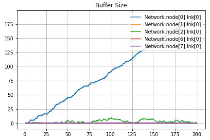

---

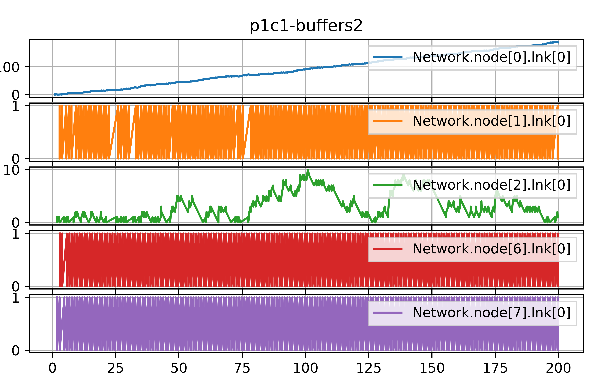

#### Caso 2
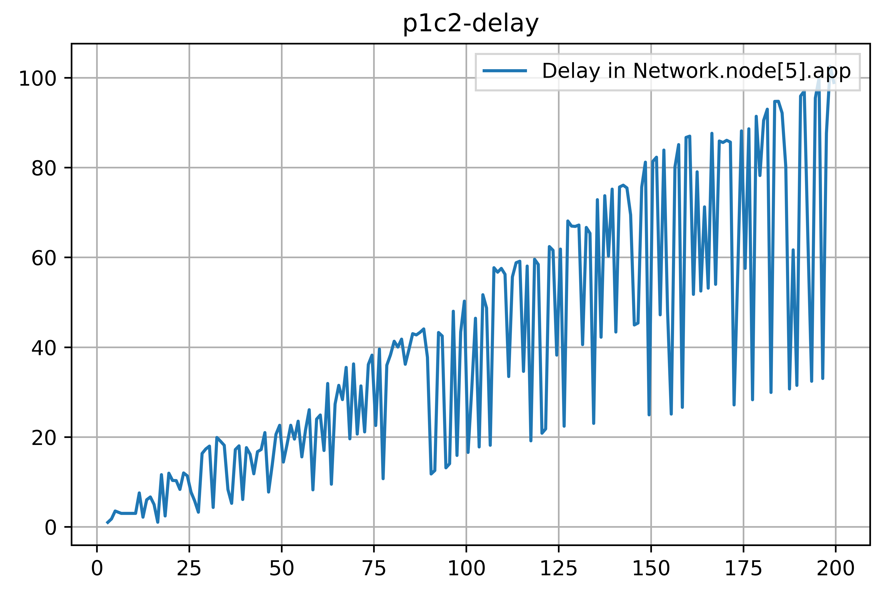

---

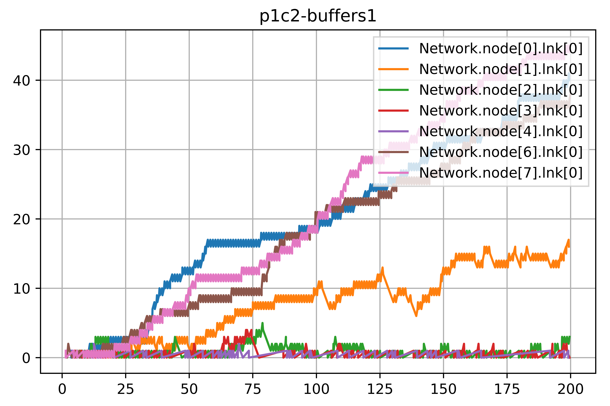

---

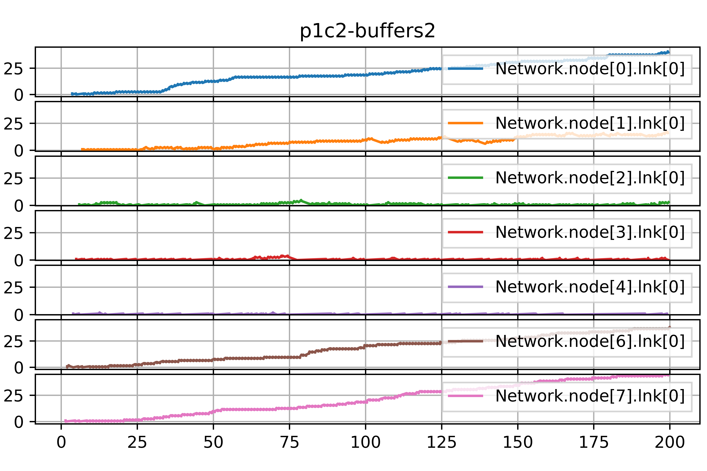

## Propuesta de solución

### Modificaciones de a la estructura de la red
las modificaciones se realizaron en el metodo handleMessage.
y a su vez en el archivo **packet.msg**
packet Packet {
    int source;
    int destination;
    int hopCount;
    int neighbours[];
}

### Algoritmo

El algoritmo que implementamos lo llamamos "Falso Dijkstra", pues internamente en cada nodo la topologia de la red se representa como un grafo donde todos caminos son de peso 1. En lugar de utilizar el algoritmo de Dijkstra para calcular las distancias mínimas entre dos nodos, se utiliza el algoritmo de BFS.

### Implementación
Se agregaron los siguientes campos:

- `routingTable`: Una tabla/map de enrutamiento.
- `graph`: Una estructura que representa el grafo de la red.
- `infoReceived`: Un map para saber cuando se recicio el paquete "info"
- `ready`: Un booleano que se utiliza para saber cuando el nodo esta listo para enviar paquetes de datos.
- `numInterfaces`: Un entero que se utiliza para saber cuantas interfaces (validas) tiene el nodo.
- `numNeighborsKnown`: Un entero que se utiliza para saber cuantos vecinos del nodo ya conocemos su id.
- `neighbors`: Un map que vincula el id de un nodo con su interfaz correspondiente.

---

Se vincularon los siguientes "tipos" de paquetes al `Kind` del paquete:

- `Hello`: Kind 3
- `HelloAck`: Kind 4
- `Info`: Kind 5

## Conclusiones y resultados de la solución
### Casos
#### Caso 1

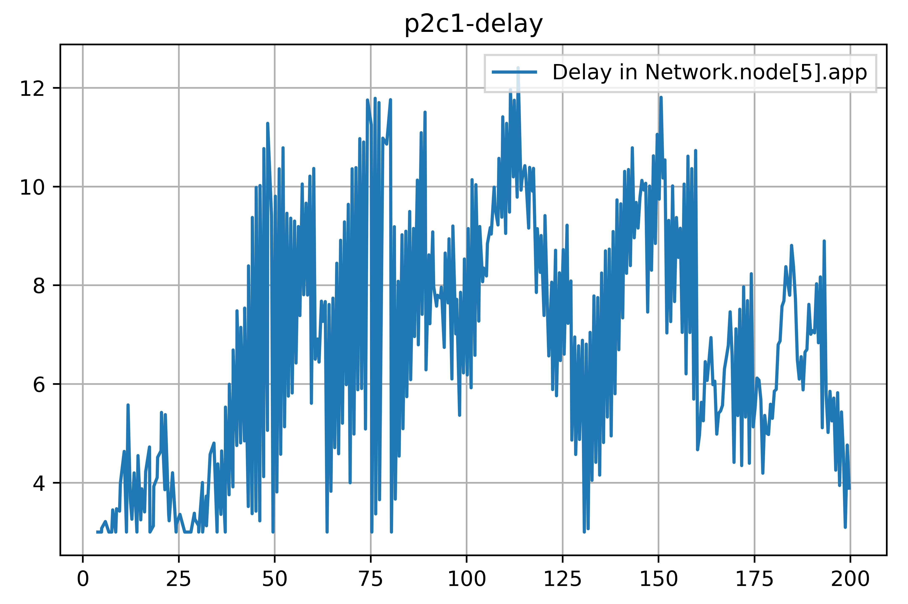{ width=300px}

---

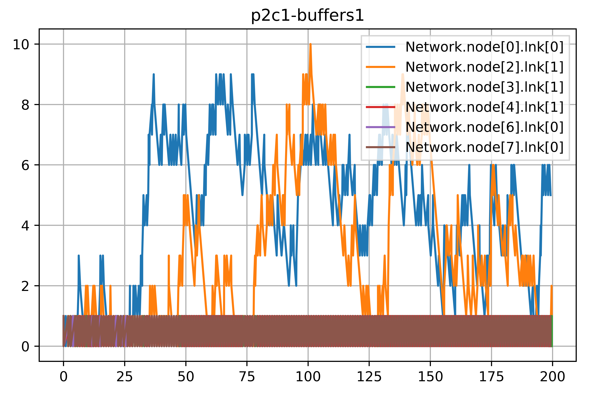

---

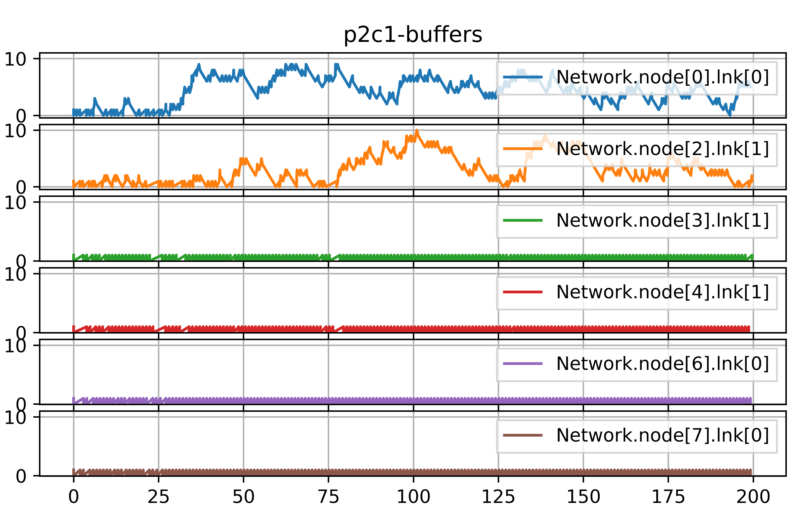

#### Caso 2

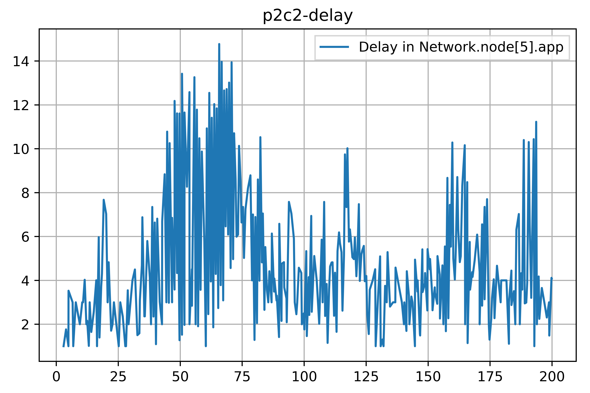

---

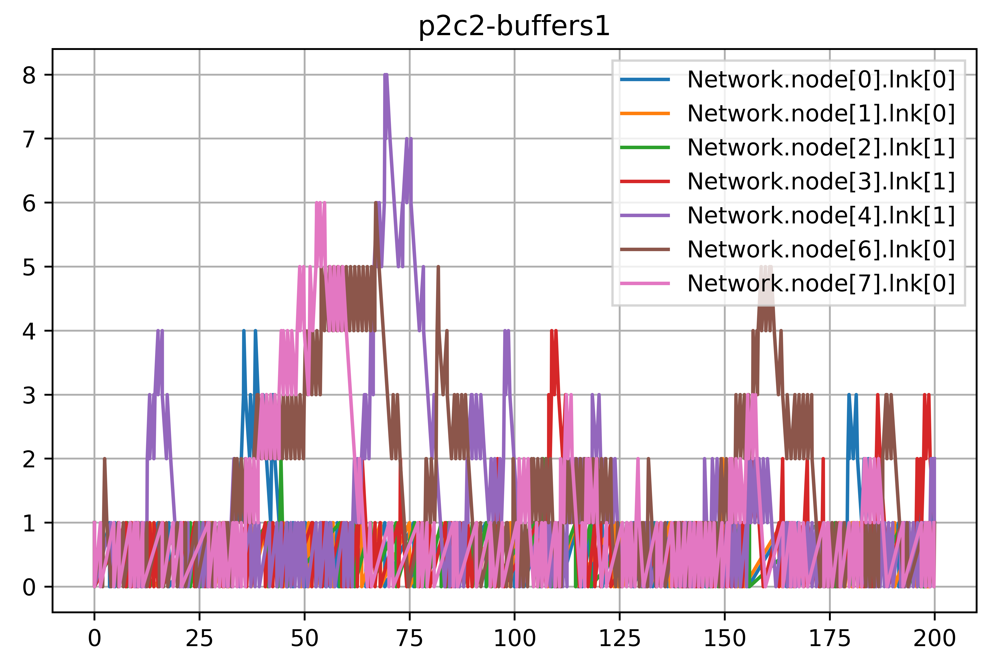

---

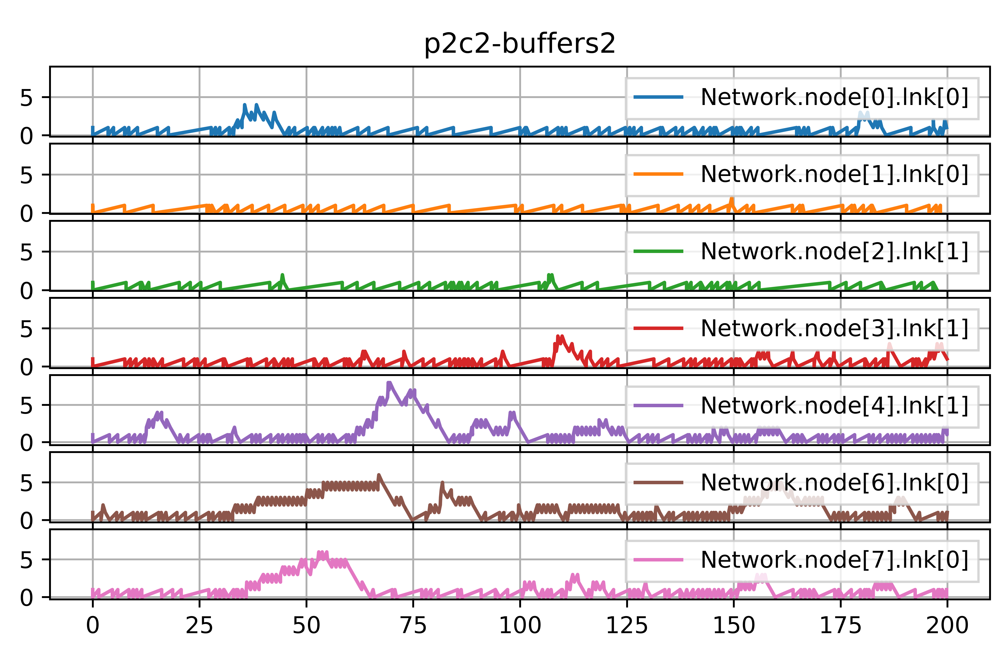

#### Equilibrio

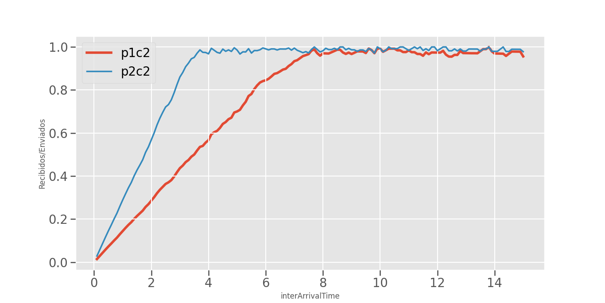

### Network Star

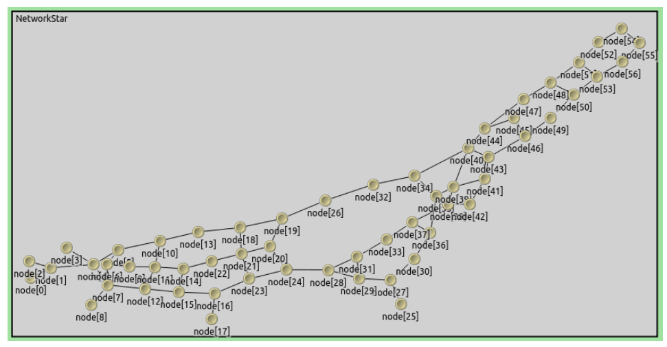

### Discusión

Con esta actividad pudimos entender el funcionamiento de una red y como diseñar una estrategia de enrutamiento para mejorar el control y lograr un uso eficiente de la misma. Aprendimos bastante sobre el funcionamiento de las redes y estrategias de enrutamiento para poder lograr implementar nuestra propia estrategia de enrutamiento.

