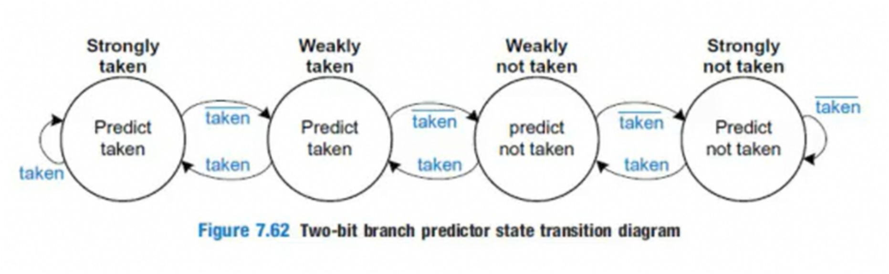
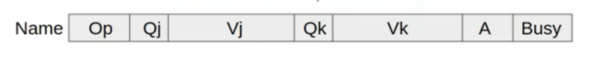
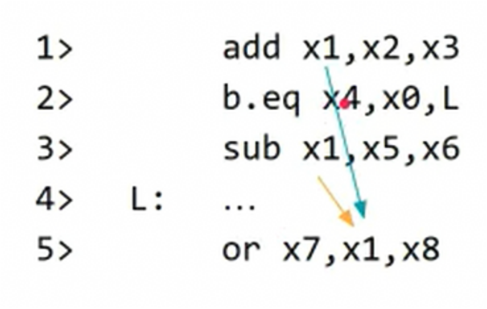

# Cache
## Interleaved memory
Se van intercalando direcciones de memoria
en distintos bloques, no de manera consecutiva.

De esta manera no hay que esperar tiempos de ciclo

## En los sistemas reales
- Se aumenta ancho de banda
- Se usa Int. Mem

# Practico 5
## Ej 1
+ rapido, + caro

### Freq acceso
El sistema de memoria que mayor numero de accesos tiene
más frecuentemente se accede

## Ej 2
### Howto
1. Fer frec. clock
2. Ver tiempo acceso memoria
3. Pasar frec. a tiempo
$$T_{clk} = \frac{1}{frec}$$
4. Dividir tiempo de acceso por $T_{clk}$


## Organizacion cache
### Areas
- Seccion de datos
    - Guarda los datos en bloques (M words)
- Bit de validacion
- Seccion de tag/etiqueta
    - Se usa como key (Como en un diccionario)

### Diferencia con la ram
A diferencia de la ram, puede que ninguna entrada coincida con el tag

## Ej 3
### Howto
#### Como saber tamaño area de datos?\
"Cache de mapeo directo de **16KiB**"

El texto en negrita es el tamaño del area de datos

#### Correspondencia directa (CHEQUEAR)
- Se guarda el numero de bloque en el tag, y de ahí hay correspondencia directa
entre la memoria de ese bloque y la cache.

- No es economicamente viable, ya que si se acceden a distintos bloques hay muchos
miss

#### Correspondencia asociativa (???)

#### Bits area tag
$$bitsTag = \frac{numBloques}{numLineas}$$

#### Cantidad bloques
$$\frac{2^N}{M}$$

#### Calcular tamaño total\
capTotal = lineas * anchoBloque

CapTotal = tamAreaDatos

AnchoBloque = cantBloques * tamBloque

- Despejar lineas

## Ej 4
### Notas
- Anotar datos enunciado
    - bloques
    - palabras por bloque
    - tamaño address
- Palabras del cache SIEMPRE hace referencia a palabras del procesador
- Ver cuantas palabras caben en area de datos
- Si hay más de una sola palabra en el area de datos hacen falta más bits para direccionar
    - Si esto sucede pueden ignorarse algunos de los bits menos significativos. A esto se le llama
    "direccionamiento de palabra"
    - En este ej no hay direccionamiento de palabra porque solo es una palabra la que se usa
- Hacerse la pregunta "Cuantas veces entra la cache en la memoria principal organizada de a bloques"
    - $tamTag = \frac{2^{addrSize}}{tamaño_{bloque}}$ ??
- Separar el address en tag, index y offset byte
- El index se usa para ver que entrada de cache usar
- Numeracion de las word: w3, w2, w1, w0.
    - Va de más grande a más chico

### Howto
- $CantBloques = \frac{tamMP}{\frac{len(w_p)}{len(w_m)}}$
1. Separar la address en los siguientes campos:
    - tag: $tamTag = \frac{cantBloques}{cantLineasCache}$ ??
    - index: cantidad lineas cache
    - wordSelector: Solo si se guarda más de una word en la cache
    - offset byte: $cantBytes = \frac{tamPalabra}{2^3}$
2. Cargar/leer datos de la linea denotada por el index
3. Setear tag y word

## Ej 5
### Howto
- Para ver tamaño address ver cuantos bits hace falta para direccionar la memoria principal
    - Lo mismo para determinar tamaño de index

## Ej 6 (VER TEORICO)
### Howto
- Si es en cuatro vias dibujamos 4 tablas
- El campo set se calcula segun cuantos conjuntos hay que direccionar
    - Si son 16 conjuntos hacen falta 4 bits

## Ej 8
- Escribir datos principales de la memoria y cache: cantPalabras, cantBloques, cantLineasCache
- El tag indica la n-esima vez que entra el cache en la memoria principal
- Para chequear si el address está bien ver si direcciona la MP
- Para calcular palabras por bloque:
$\frac{{cantPalabras}}{{cantBloques}}$

### a) Correspondencia directa
- tag:
$\frac{{cantBloques}}{{cantLineasCache}}$
- Index: cantLineasCache
- W: CantPalabrasPorBloque =
$\frac{{cantPalabras}}{{cantBloques}}$

### b) Full asociativa
- w: cantPalabrasPorBloque
- tag:
$\frac{{cantPalabrasMP}}{{cantPalabrasPorLineaCache}}$

### c) Asociativa por conjuntos
- set:
$\frac{cantLineasCache}{cantVias}$
- w: cantPalabrasPorBloque
- tag:
$\frac{{cantBloquesMP}}{{cantLineasPorVia}}$

## Ej 9
$$AMAT = hitTime + missRate * missPenalty$$
$$ClockCycles = CPI + \frac{memAccesses}{instructionCount} * missRate * missPenalty$$

### 9d
Hay que calcular para stall-data y stall-instructions y luego sumar
$$CPI_prom = CPI + memStallData + memStallInst$$
$$memStallClockCycles = \frac{memAccesses}{instructionCount} * missRate * missPenalty$$

## Ej 10
- FrecClock = 1/HitTime
- MissPenalty = tiempo acceso mem principal

# Tecnicas de prediccion de saltos
## "Operador ternario" para evitar saltos
En vez de hacer un salto, se pueden usar instrucciones que funcionan de manera
similar a un operador ternario.

Este cambio lo realiza el compilador.

## BTFNT
Backward taken forward not taken.

Si se salta para atras se asume taken y para adelante not taken

## Predictores locales
Predicen en base a predicciones anteriores del mismo salto

### Predictor de 2 bits



## Predictores globales
### Predictor de dos niveles
- Realizan la prediccion usando los ultimos n saltos ejecutados
- Usan un shift register (GR) que guarda si los ultimos n saltos fueron Taken (1) o Not Taken (0)

#### PHT
- PHT: pattern history table
- Se indexa con GR + PC
- Guarda dos bits que siguen la misma logica que el predictor de 2 bits

### Predictor gshared
- Usa GR y tabla PHT como en el predictor de dos niveles
- Hace un XOR entre el GR y los ultimos bits del PC

### Predictor por torneo
- Usa predictores globales o locales segun el tipo de instruccion en base a un
selector (el cual tambien "se entrena")
- Tiene la ventaja de que usa el mejor predictor posible para cada caso

### Tagged hybrid predictors
- Usa muchos predictores de dos niveles pero con distintos tamaños de GR

# Practico 6
## Ej 1
- $LatEtapa = tiempoCiclo (Tc) = \frac{tiempoTotal}{N}+ penalidadRegistroPipeline$
- $CPI = 1.23 + 0.1 * (N-5)$
- $tiempoPorInstruccion (Ti) = Tc * CPI$


## Ej 2
- La penalidad si se hace un fetch incorrecto es de N

$$cantCaminoCorrecto + fetchPenalty * missedFetches$$

$cantCaminoCorrecto = \frac{cantInst}{W}$

## Ej 3
$$precision = \frac{aciertos}{total}$$

### b)
- Hacer tabla con patron, prediccion y fallo o acierto

## Ej 4
### a)
- Pensar solo en el contexto de la instruccion
- Se puede predecir el salto que realiza una instruccion si el numero que usa es aleatorio?

### b)
- Hay algun if que si o si se ejecute si los otros dos se ejecutan?

## Ej 6
- Solo hay forwarding entre issue packets, no hay forwarding interno entre dos instrucciones

### Tips:\

### a)
- Hacer tablita pipeline
- Hacer mismo procedimiento que con pipeline
- No se tiene en cuenta WAW porque es 1-issue

### b)
- Hacer tablita

| ALU or Branch | Data | Clk |

### c)
#### Loop unroling
- Duplicar el codigo para loopear menos veces y poder emparejar mejor las instrucciones

#### Tener en cuenta\
- Dependencias de nombres no pueden ir juntas
- Dependencias de datos no pueden ir juntas
- Si hay dependencias de datos hay que hacer stall
- Si se lee y despues se escribe un registro pueden ir juntos.
(Pensarlo usando la tabla)


# Static multiple issue
- Se complejiza más el micro para ejecutar dos instrucciones a la vez
- Se arma un camino para las instrucciones que acceden a memoria y otro para las que no

## Como se agrupan las instrucciones paralelas?
- Se agrupan en *issue packets*
- Se suelen agrupar instrucciones tipo R o Branch y instrucciones de acceso a memoria
- Las instrucciones se leen de a dos (64 bits)
- Si uno de los issue no se puede usar, se lo acompaña con un nop

- Compilador revisa dependecias de datos en un issue packet
- No se puede hacer forwarding dentro del mismo issue packet
- Asumimos que no hay dependencias de memoria (se encarga el hardware), solo de registros

## Tipos de dependencias de datos
### Dependencia real de datos
Es lo que veniamos haciendo en pipeline

### Dependencia de nombre
Cuando dos instrucciones del mismo Issue Packet escriben el resultado
en el mismo registro

#### Como se soluciona?
Usando registry renaming

## Hazards
### RAW (Read After Write)
Es causada por la dependencia real de datos

### WAW (Write After Write)
Es causada por la dependencia de nombre

## Dependencias de control
Cuando tenemos un branch y luego una instruccion
normal, la instruccion se ejecuta por más que el branch
tenga que hacer un salto

#### Casos\
- Branch + instruccion
- Instruccion que depende de un salto + instrucccion que no depende

#### Solucion\
Emparejar con nop

# Dynamic scheduling
## Definicion
Hardware reordena las instrucciones para evitar stalls y manteniendo flujo de datos
y exception behaviour

## Unidades funcionales (FU)
Hardware que realiza una operacion

### Ejemplos
- ALU
- Memoria
- Multiplicador
- Etc

## Reservation Stations
Registros asociados a una Unidad Funcional que guardan:

- Operacion
- Operandos necesarios

### Campos


- Op: operacion a realizar
- Qj, Qk: Tag de la RS que va a producir el operando necesario
    - Un valor de 0 indica que ya se encuentra disponible
- Vj, Vk: Valores de los operandos
    - Para loads, Vk guarda el offset
- A: contiene el resultado del calculo de direccion
    - Aplica solo a load o store
- Busy:
    - 1: cuando se está ejecutando
    - 0: cuando está en espera

## Algoritmo de Tomasulo
### Idea
- Captuar operandos apenas estan disponibles para evitar recurrir a registros

### Que pasa si hay dependencias de datos?
Se designa la RS que producira el operando necesario

### Load y store
Para evitar complicaciones, asumimos que siempre se ejecutan en orden y que se
frena la ejecucion si hay dependencia de datos

## Etapas Tomasulo
### Fetch (IF)
- Se levantan instrucciones de memoria
- Se colocan en la FIFO

### Issue y Decode (IS/ID)
Se decodifican las instrucciones.

#### Si hay RS\
- Se le pasa la instruccion y operandos

#### Si no hay RS\
- Hace stall hasta que haya una libre

#### Si los operandos no estan en registros\
- Se linkea con la RS que lo producira
- La instruccion queda en espera hasta poder ejecutarse

### Execute (Ex)
#### Cuando todos los operandos estan listos\
- La instruccion se ejecuta en la UF correspondinte

#### Loads y stores\
- Requieren que se calcule la direccion de memoria antes de poder acceder a ella
- La direccion calculada se almacena en orden en el buffer correspondiente usando
orden de ejecucion del programa
    - Esto previene hazard de memoria

### Write result (Wb)
#### Que es el CDB?\
Es el Common Data Bus y se encarga de escribir el resultado en los lugares
necesarios

#### Cuando el resultado está disponible\
Se usa la CDB para escribirlo en:

- Los registros
- Las RS que lo necesitan

## Dependencias de datos
### Real dependencia de datos (RAW)
Instr1 produce dato usado por instr2

### Dependencias de nombre
- Dos instrucciones usan mismo registro o posicion de memoria
    - Sin flujo real de datos

#### Dependencia de salida (WAW)\
- Instr1 e Instr2 escriben misma posicion de memoria o registro
- El orden original se debe preservar para que el valor final sea correcto

#### Antidepenencia (WAR)\
- Instr1 escribe registro o posicion de memoria que Instr2 necesita leer
- El orden debe preservarse para asegurar que se lea el dato correcto

#### Register renaming\
- Soluciona dependencias de nombre cambiando el nombre de los registros usados

### Dependencia de datos condicional
- El orden del programa establece que instr1 genera el dato necesario para instr2
- Por más que haya dos dependencias solo se puede dar 1 hazard
- Cual hazard se genera depende del salto condicional

#### Ejemplo \



## Depenencias de control
Todas instrucciones cuya ejecucion depende de un salto tienen una dependencia de control
con dicho salto

# Practico 7
## Ejercicio dependencias
### Dependencia datos
Clasificar en:

- WAW
- RAW
- WAR

Si depende de un salto agregar que es condicional

### Dependencia de control
Todas las instr que dependan del salto

## Ej 1
### Denotar valor dentro de un registro
Se usa \[x2\]

### Notas
- Calcular el address para stur y ldur toma un clock
- El Wb toma 1 clk
- Solo un load/store puede estar busy a la vez

#### Ejemplo\
Si hay un salto al final del programa que va hacia el inicio todas las instrucciones
del medio tienen dependencia de control con esta ultima instruccion

# Howto Tomasulo
Cargar datos en tabla Stage:

## IF (1 clk)
- Toma 1 clk

## IS (1 clk):
- cargar datos instruccion en RS
    - Siempre se elige la primer libre
    - Si dato no está, cargar tag en Q
- cargar datos Register status para el registro target
- No se puede alterar el orden al pasar de IF a IS
    - No puede pasar la instr8 antes que la instr5
- Si justo se esta escribiendo un registro que necesita una nueva instruccion de issue
se pone en el V, pero se marca como que no se puede usar aun
- Si dos instrucciones modifican el mismo registro ponemos la ultima instruccion en el tag del Register Status

## Ex:
### Load/store
- Load/Store son secuenciales
    - Solo se ejecuta 1 a la vez, no en paralelo (no store al mismo tiempo que load)
- Calcular Addr (1 clk)
    - Se pone solo el offset primero en A y luego se pone \[Xi + offset\]
    - No se marca como Busy

### Caso normal
- Ejecutar instruccion (Clk depende del tipo de RS)
    - Marcar como busy
- Instrucciones con FU distintas pueden correr en paralelo, pero si son del mismo tipo no
- Si es un Branch, no se hace más issue hasta que termine

## Wb (1 clk):
- Borramos datos RS, pero marcamos como que aun no se puede usar
    - Esto lo hacemos porque la escritura del dato está en proceso
- Borramos tag Register Status, pero marcamos como que aun no se puede usar
    - Reemplazamos en las RS que lo usan, pero marcamos como que aun no se puede usar
    - Reemplazamos los Q por 0


# Preguntas
- Cuando hay varias words en una linea de cache, cuando se guarda data en
el cache, guarda solo la word que marca la address o guarda todo?
    - Respuesta: se guarda todo el bloque siempre
- El wordSelector es big endian o little endian?
    - Respuesta: Mas significativo a la izquierda
    - Osea, se usaria el siguiente orden: w3, w2, w1, w0

## Como funciona/se calcula el resultado usando la PHT?
Supongamos que se inicializa toda la PHT en 0b10 (Weakly taken)
A medida que se va ejecutando la instruccion se compara la prediccion con
el resultado real (T o NT) y en base a eso se va actualizando el contenido de la PHT
(Usando la maquina de estados)

\newpage

### Ejemplo
```c
for (i=0; i < 100; i++) {
    for (j=0; j< 3; j++) {
        ...
    }
}
```

```asm
0x00: add x0, xzr, xzr
0x04: L2: add x1, xzr, xzr
0x08: L1: …
0x0C: addi x1, x1, 1
0x10: cmpi x1, 3
0x14: b.lt L1
0x18: addi x0, x0, 1
0x1C: cmpi x0, 99
0x20: b.lt L2
```

(Tomamos ultimos 4 bits del PC)

| GR   | PC  | PHT | Taken? |
|------|-----|-----|--------|
| 0000 | 0x4 | 10  | True   |
| 0001 | 0x4 | 10  | True   |
| 0011 | 0x4 | 10  | False  |
| 0110 | 0x0 | 10  | True   |
|------|-----|-----|--------|
| 1101 | 0x4 | 10  | True   |
| 1011 | 0x4 | 10  | True   |
| 0111 | 0x4 | 10  | False  |
| 1110 | 0x0 | 10  | True   |
|------|-----|-----|--------|
| 1101 | 0x4 | 11  | True   |
| 1011 | 0x4 | 11  | True   |
| 0111 | 0x4 | 01  | False  |
| 1110 | 0x0 | 11  | True   |
|------|-----|-----|--------|
| 1101 | 0x4 | 11  | True   |
| 1011 | 0x4 | 11  | True   |
| 0111 | 0x4 | 00  | False  |
| 1110 | 0x0 | 11  | True   |


# P (A) 2023
## 1)
### Calcular tag
- $\frac{tamMemoriaB}{tamCacheB}$
    - Hay que agregar bytes, no poner por ejemplo $2^{64}$ si no $2^{64}B$
- $\frac{cantBloques}{tamIndex}$
    - $cantBloques = \frac{cantWmMemPrincipal}{cantWmPorLineaCache}$

### Llenar tabla
- Desglosar addr en los campos y rellenar
- Si hay dos index iguales se pisan
- Solo hay hit si coinciden tag e index con un elemento ya existente

### Calcular AMAT
$$AMAT = hitTime + missRate * missPenalty$$

### Calcular tiempo hit (REPASAR)\
- $\frac{1}{1Ghz}$
- $1/hz = s$

### Consideraciones Asoc Conjuntos
- Lineas por via = $\frac{lineasCache}{cantVias}$
- Para determinar la cantidad de vias ver cuantas veces se sobreescribe una linea en la cache
    - En AC no se sobreescriben lineas
- Se duplican cantidad words por bloque
    - Por ende, se duplica tamaño bloque
    - Esto depende de la cantidad de vias, en este caso 2, por eso se duplica


## 2)
### a)
- No importa distancia entre instrucciones, pueden ser dependencias pero no hazard

### b)
- Si una instruccion es destino de un salto, no puede ir junto a otra en el mismo issue packet
- Los branch suelen ir solos acompañados con un nop, salvo algunas excepciones

### c)
- Tener en cuenta que una vez se llega a al ultimo issue, se demoran 5 ciclos más
en terminarse de ejecutar todas las instrucciones pendientes


# P2022 B
## Ej 2
Tag asoc conjuntos:

- tag = $\frac{\frac{MPSize}{WpSize}}{cantLineas}$
- tag = $\frac{MPSize}{CacheSize}$

