# Teorico Introduccion
## 1)
\


# Modelar diagrama entidad-relacion
## 1)
\


# Traducir diagrama a conjunto de esquemas
## 1)
\


\


## 2)
\


# Explicar caracteristicas problematicas
## 1)
\


# Teorico DER
## 1)
\


# Normalizacion

## 1)
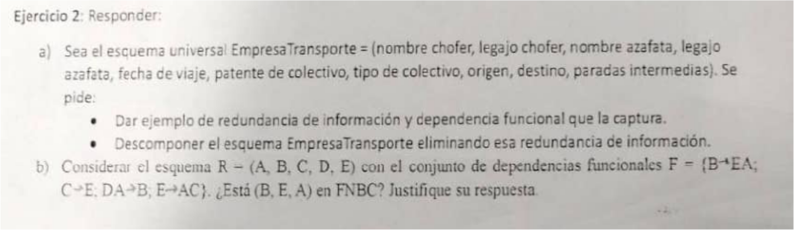

## 2)

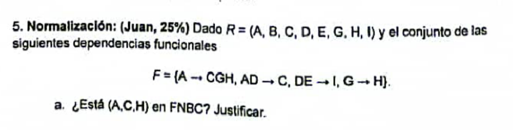

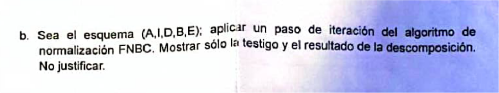

### Resolucion

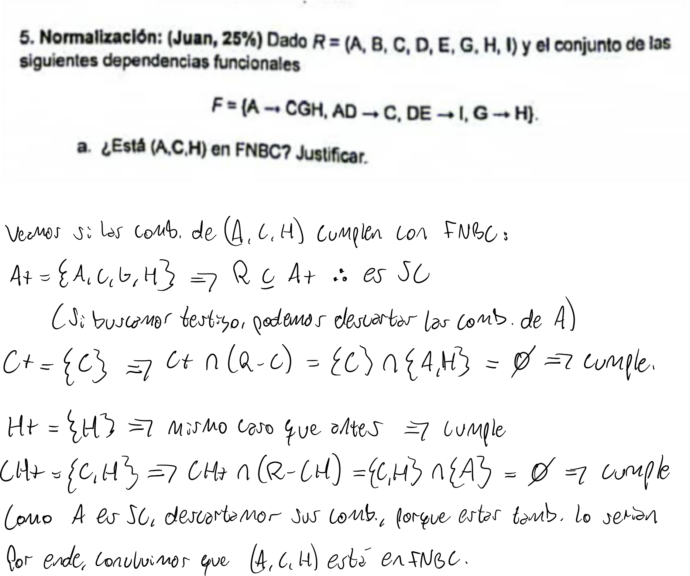

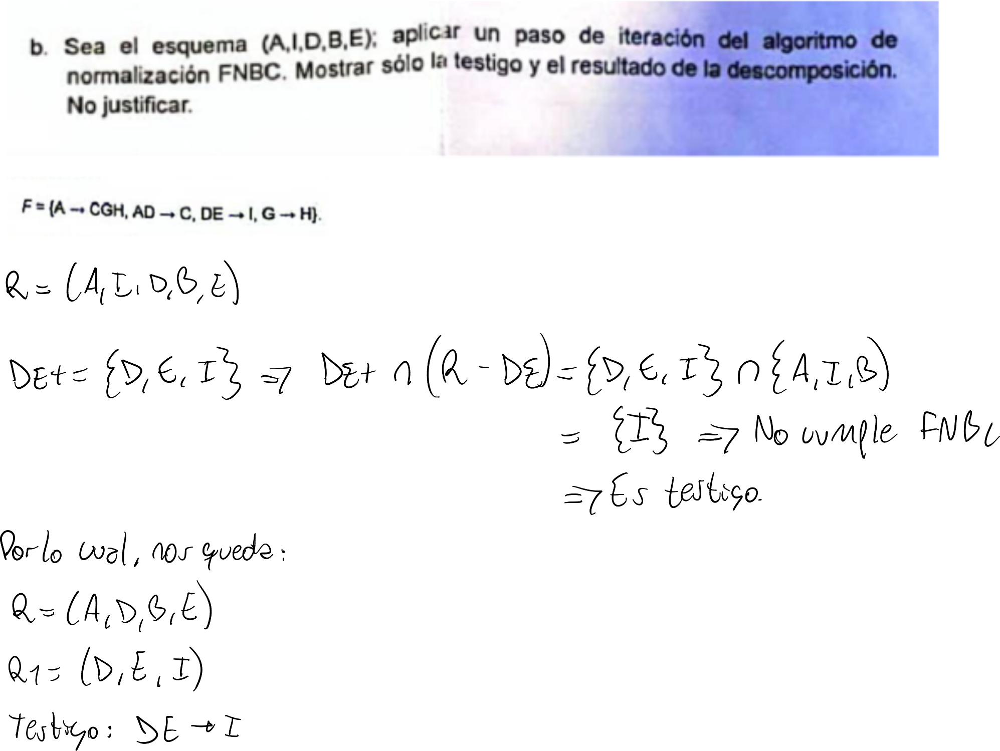

## 3)

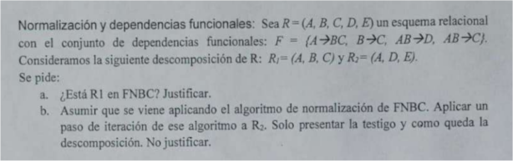

# Dependencias funcionales

## 1)
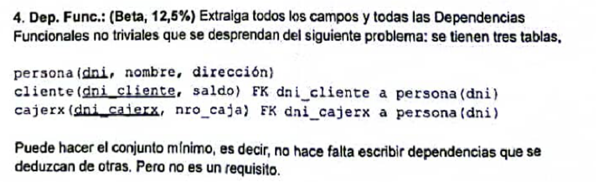


## 2)

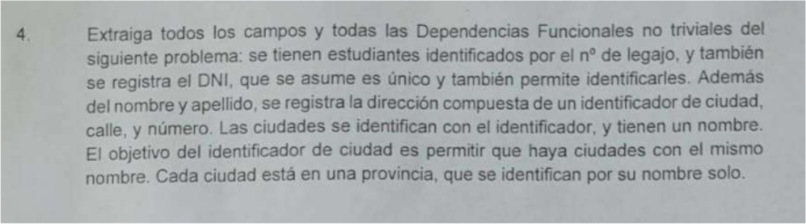

# Modelo Duran
## 1)

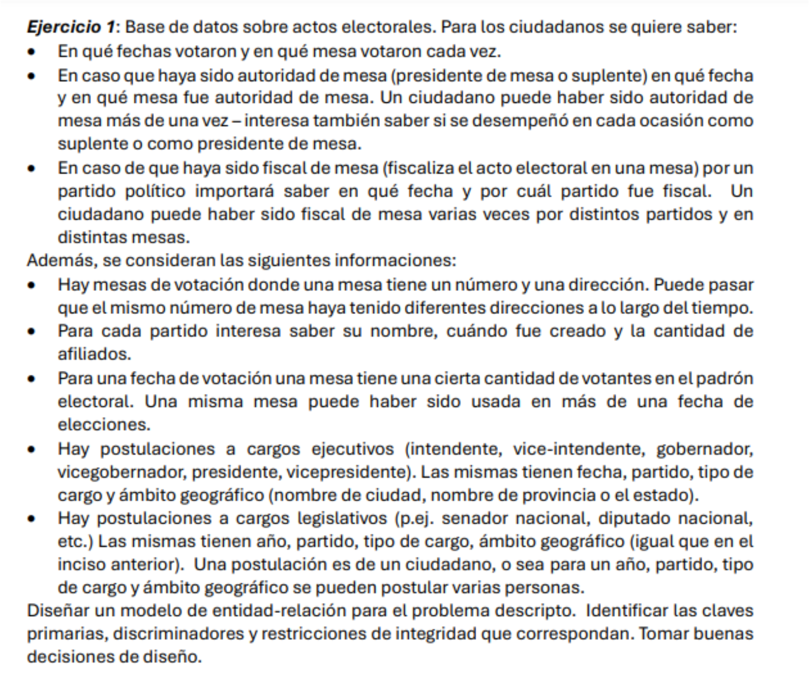


## 2)

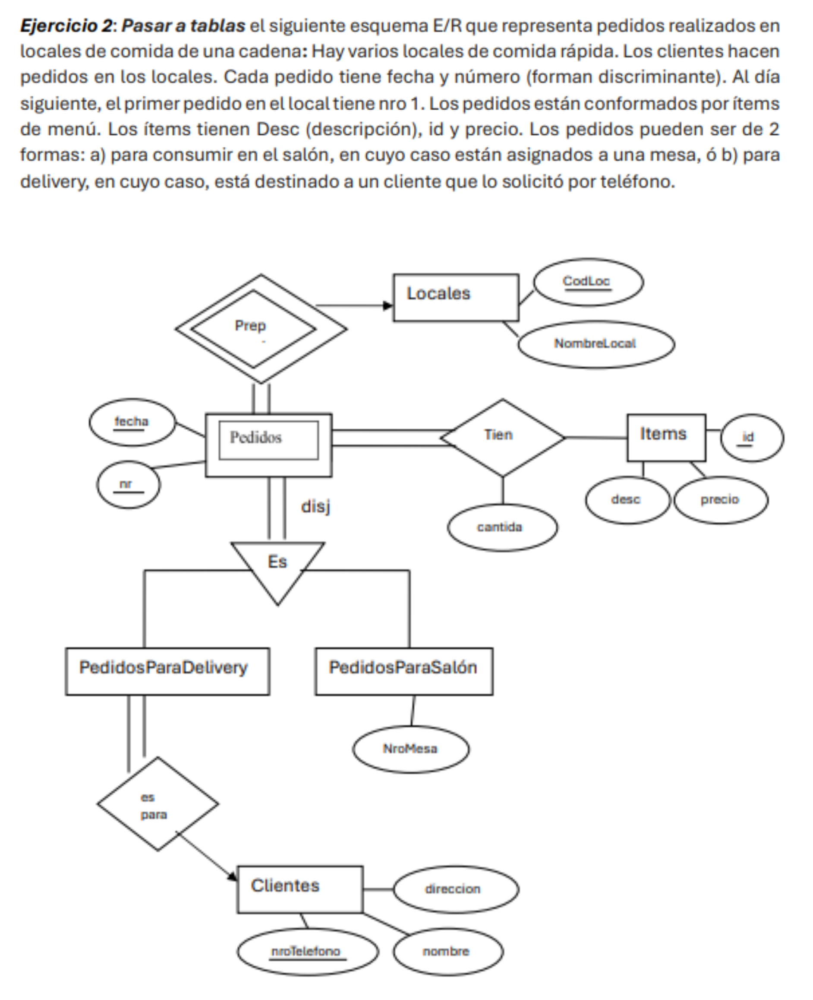

### Howto
#### Relaciones many-to-many
- Hace falta una tabla intermedia para representarla

#### Que es un CE debil?
Que no tiene clave primaria

#### Que se hace con los CE debiles?
Se usa clave primaria de los CE de los que dependen

#### Generalizacion disjunta?

#### Que significa si hay una flecha apuntando al CE?
Una relacion a uno

#### Totalidad
Se representa con flechita/linea doble
Si hay totalidad y es 1-1, la CP se pone en el que tiene totalidad

Si es totalidad muchos-muchos, marcas todo como CP

#### Tips
- Siempre pensar que pasaria si la informacion se repite en distintas
entidades, seria posible distinguir una de otra?
    - Por ejemplo, si hay dos pedidos con la misma fecha y mismo numero
    - Ahí haria falta diferenciarlos usando el local al que pertenecen

### Resolucion
Locales(**CodLoc**, nombreLocal)

TieneItem(**fecha**, **nr**, **id**, cantidad), FK fecha, nr; FK id

Items(**id**, precio, desc)

PedidosParaDelivery(**fecha**, **nr**, **CodLoc**, nroTelefono) FK nroTelefono

Clientes(**nroTelefono**, direccion, nombre)

PedidosParaSalon(**fecha**, **nr**, **CodLoc**, **NroMesa**)

## 3)

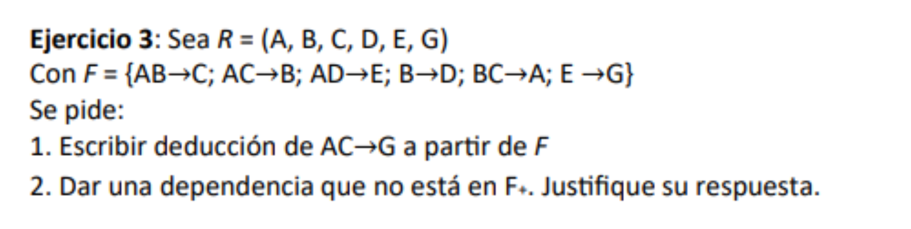

### Howto (1)
- Partir del lado izquierdo de lo que piden e intentar llegar al derecho
    - En este caso, partir de AC y llegar a G
- Ir aplicando reglas de armstrong
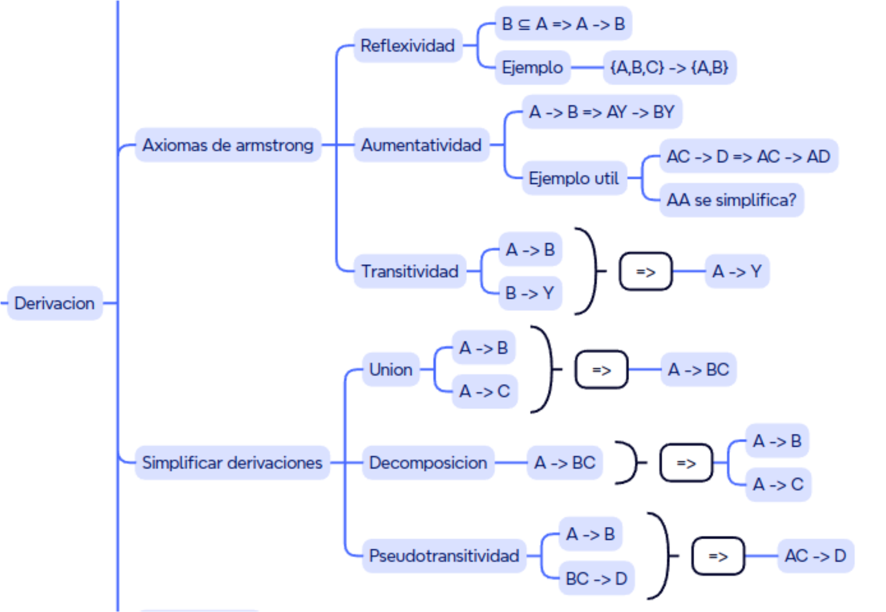

### Howto (2)
1. Plantear que para dar una dependencia que no esté en F se tiene que dar:
$$\neg(F\vdash A \rightarrow B) \Leftrightarrow \neg(B \subseteq A+)$$

2. Por ende, elegimos algun $A$ y $B$ tal que $B\nsubseteq A+$
3. Comprobamos

### Resolucion
#### 1.\
Partimos de AC y veamos a que llegamos

```
AC -> B
{Transitividad: AC -> B, B -> D => AC -> D}
AC -> D
{Aumentatividad: AC -> D => AC -> AD}
AC -> AD
{Transitividad AC -> AD, AD -> E => AC -> E}
AC -> E
{Transitividad AC -> E, E -> G => AC -> G}
AC -> G
```

#### 2.\
Para dar una dependencia que no está en F+, planteamos lo siguiente:
$$F \vdash \alpha \to \beta \Leftrightarrow \beta \subseteq \alpha+$$

Ahora negamos ambos lados y obtenemos:
$$\neg(F \vdash \alpha \to \beta) \Leftrightarrow \neg(\beta \subseteq \alpha +)$$

Por ende, buscamos algun $\alpha$ y $\beta$ tal que $\beta \nsubseteq \alpha +$

Elijamos $\alpha = E$ y $\beta = \{A\}$:
$$E+ = \{E, G\}$$
$$\therefore \{A\} \nsubseteq E+$$

Por ende, hemos hallado una dependencia que no está en F+

## 4)

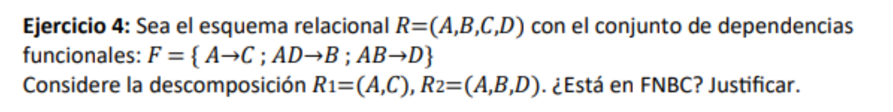

### Howto
Para cada relacion $\alpha \in R_i$ se tiene que cumplir una de las siguientes:

- $\alpha^+ \cap (R_i - \alpha) = \emptyset$
- $R_i \subseteq \alpha^+$: es decir, es superclave

Si alguna de las dos no se cumple, no es FNBC

#### Testigo
Es una DF

Para determinarla pensar que el cierre determine el resultado de la interseccion

Cierre -> resultado interseccion

#### Clave candidata
Es superclave pero sus componentes no lo son

### Resolucion
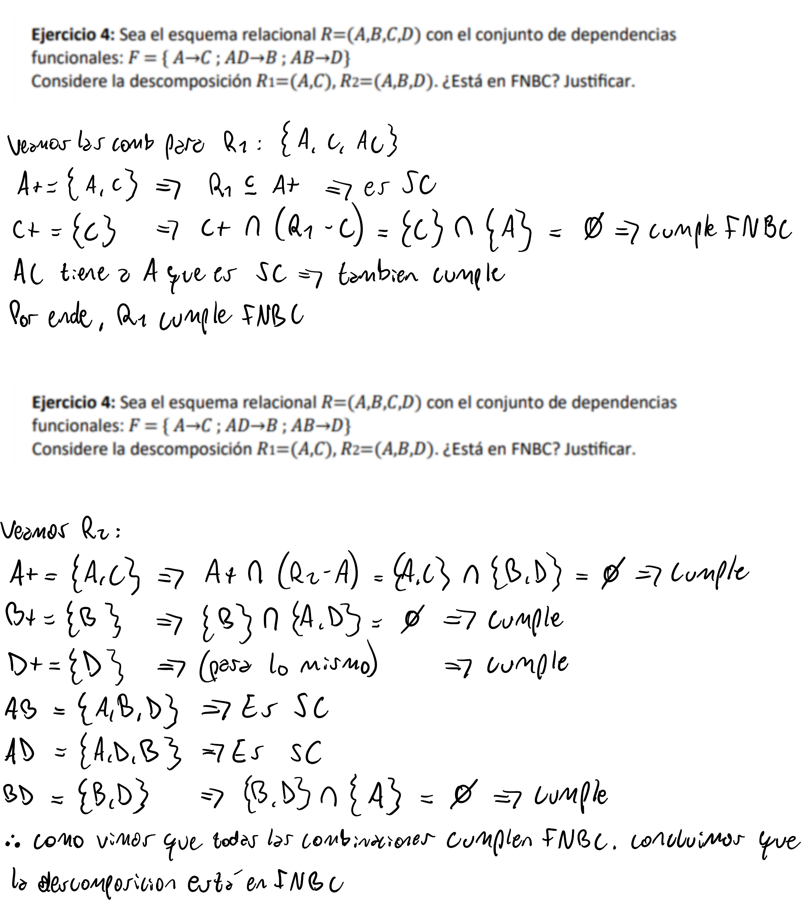


## FNBC

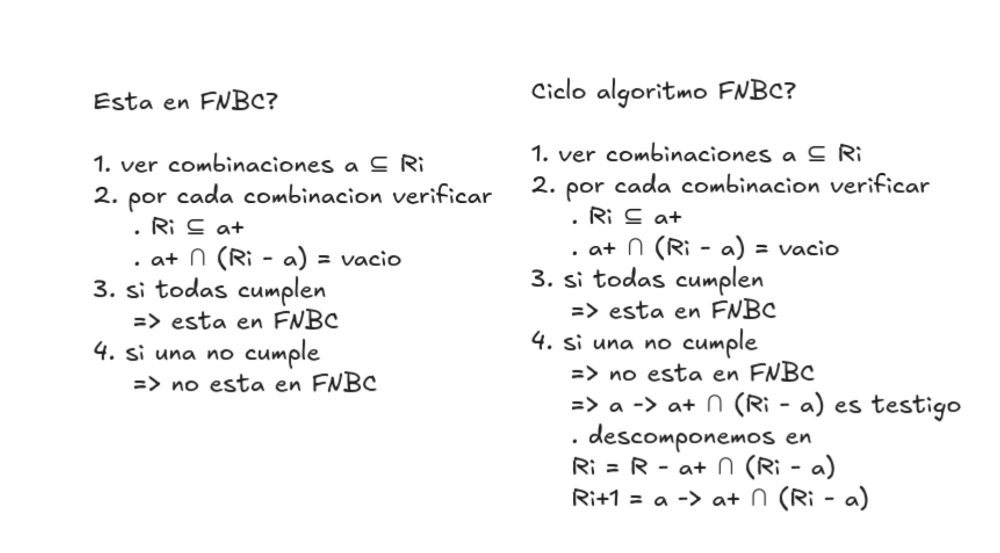

## Significado diagrama
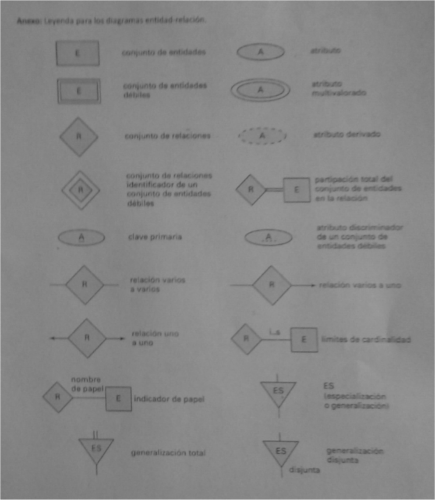


